# Directorio de Transcripciones y Síntesis de Conferencias: Investigación en Fibromialgia (FM)

Este directorio contiene las transcripciones estructuradas, resúmenes ejecutivos y análisis de integración metodológica de las conferencias, webinars y simposios científicos clave identificados para potenciar la **Fase 3 (Tangentes de Investigación)** y la actualización del manuscrito principal v2.2 sobre **Fibromialgia (FM)**.

---

## 🗺️ Mapa General de Transcripciones por Pilar Metodológico

```mermaid
graph TD
    subgraph Pilar1["Pilar 1: Autoinmune Periférico y Células Gliales Satélite"]
        T1["01_goebel_autoimmune_fibromyalgia.md<br/>(Prof. Andreas Goebel - Passive IgG Transfer)"]
        T2["02_autoimmune_shift_fibromyalgia.md<br/>(Autoimmune Shift & SFN Overlap)"]
        T3["03_iasp_sgc_neuropathic_pain.md<br/>(Dr. Ru-Rong Ji - SGCs GJA1/Kir4.1 in DRG)"]
    end

    subgraph Pilar2["Pilar 2: Neurobiológico Central y Receptor DRD2"]
        T4["04_jarred_younger_neuroinflammation.md<br/>(Dr. Jarred Younger - PET TSPO & Microglia)"]
        T5["05_drd2_splicing_isoforms.md<br/>(DRD2 Splicing Isoforms D2S vs D2L)"]
        T6["06_pramipexole_dopamine_agonists.md<br/>(Pramipexole RCTs & LE 0.384 Docking)"]
    end

    subgraph Pilar3["Pilar 3: Inmunológico y Receptores Nociceptivos No Canónicos"]
        T7["07_mrgprx2_mast_cell_neuron.md<br/>(MRGPRX2 & Mast Cell-Neuron Crosstalk)"]
    end

    T1 & T2 & T3 --> Tangente1["Tangente 1: Autoantígenos SGC/DRG<br/>(GJA1 PDB 7F94 / Kir4.1 PDB 6M84)"]
    T4 & T5 & T6 --> Manuscrito["Manuscrito Principal v2.2<br/>(preprint_dopaminergic_convergence_FM.md)"]
    T7 --> Tangente2["Tangente 2: Bucle Neuro-Inmune<br/>(Basófilos/Mastocitos vía MRGPRX2/FcγRIIIa)"]
```

---

## 📚 Índice Detallado de Documentos

| ID Archivo | Título del Video / Conferencia | Ponente / Organización | Pilar Metodológico | Archivos Relacionados en el Proyecto |
| :--- | :--- | :--- | :--- | :--- |
| [`01_goebel_autoimmune_fibromyalgia.md`](file:///home/gris/.hermes/workspace/ACTIVE/protein-lab/investigacion-fibromialgia/literatura/transcripts/01_goebel_autoimmune_fibromyalgia.md) | *Could fibromyalgia have an autoimmune condition?* | Dr. Andreas Goebel (Univ. of Liverpool) | **Pilar 1** (Autoinmune Periférico) | [`analisis/TANGENTE1_MAPA_MECANISTICO_INTEGRADO.md`](file:///home/gris/.hermes/workspace/ACTIVE/protein-lab/investigacion-fibromialgia/analisis/TANGENTE1_MAPA_MECANISTICO_INTEGRADO.md) |
| [`02_autoimmune_shift_fibromyalgia.md`](file:///home/gris/.hermes/workspace/ACTIVE/protein-lab/investigacion-fibromialgia/literatura/transcripts/02_autoimmune_shift_fibromyalgia.md) | *The Autoimmune Shift: New Research in Fibromyalgia* | International Pain Congress | **Pilar 1** (Autoinmune Periférico) | [`analisis/TANGENTE1_AUTOANTIGENOS_SGC_DRG.md`](file:///home/gris/.hermes/workspace/ACTIVE/protein-lab/investigacion-fibromialgia/analisis/TANGENTE1_AUTOANTIGENOS_SGC_DRG.md) |
| [`03_iasp_sgc_neuropathic_pain.md`](file:///home/gris/.hermes/workspace/ACTIVE/protein-lab/investigacion-fibromialgia/literatura/transcripts/03_iasp_sgc_neuropathic_pain.md) | *Translational Science in Neuropathic Pain & SGCs* | Dr. Ru-Rong Ji (IASP) | **Pilar 1** (Autoinmune Periférico) | [`analisis/TANGENTE1_AUTOANTIGENOS_SGC_DRG.md`](file:///home/gris/.hermes/workspace/ACTIVE/protein-lab/investigacion-fibromialgia/analisis/TANGENTE1_AUTOANTIGENOS_SGC_DRG.md) |
| [`04_jarred_younger_neuroinflammation.md`](file:///home/gris/.hermes/workspace/ACTIVE/protein-lab/investigacion-fibromialgia/literatura/transcripts/04_jarred_younger_neuroinflammation.md) | *Neuroinflammation, Microglia, and Brain-Body Signaling* | Dr. Jarred Younger (UAB) | **Pilar 2** (Neurobiológico Central) | [`preprint_dopaminergic_convergence_FM.md`](file:///home/gris/.hermes/workspace/ACTIVE/protein-lab/investigacion-fibromialgia/preprint_dopaminergic_convergence_FM.md) |
| [`05_drd2_splicing_isoforms.md`](file:///home/gris/.hermes/workspace/ACTIVE/protein-lab/investigacion-fibromialgia/literatura/transcripts/05_drd2_splicing_isoforms.md) | *Dopamine D2 Receptor Isoforms (D2S vs D2L) & Splicing* | SfN / QBio Conferences | **Pilar 2** (Neurobiológico Central) | [`analisis/DRD2_SQTL_SPLICE_ANALYSIS.md`](file:///home/gris/.hermes/workspace/ACTIVE/protein-lab/investigacion-fibromialgia/analisis/DRD2_SQTL_SPLICE_ANALYSIS.md) |
| [`06_pramipexole_dopamine_agonists.md`](file:///home/gris/.hermes/workspace/ACTIVE/protein-lab/investigacion-fibromialgia/literatura/transcripts/06_pramipexole_dopamine_agonists.md) | *Dopamine Agonists (D2/D3) & Pramipexole in Pain* | Clinical Pharmacology Symposia | **Pilar 2** (Neurobiológico Central) | [`docking_runs/pramipexole_drd2_docking.json`](file:///home/gris/.hermes/workspace/ACTIVE/protein-lab/investigacion-fibromialgia/docking_runs/) |
| [`07_mrgprx2_mast_cell_neuron.md`](file:///home/gris/.hermes/workspace/ACTIVE/protein-lab/investigacion-fibromialgia/literatura/transcripts/07_mrgprx2_mast_cell_neuron.md) | *MRGPRX2 and Mast Cell-Neuron Crosstalk* | Neuroimmunology Symposia | **Pilar 3** (Inmunológico No Canónico) | [`analisis/TANGENTE1_MAPA_MECANISTICO_INTEGRADO.md`](file:///home/gris/.hermes/workspace/ACTIVE/protein-lab/investigacion-fibromialgia/analisis/TANGENTE1_MAPA_MECANISTICO_INTEGRADO.md) |

---

## 💡 Resumen de Utilidad Metodológica para la Fase 3

1. **Estratificación Dicotómica (Subtipos A vs B):** Las conferencias de Goebel, Younger y los datos de sQTL de DRD2 consolidan la hipótesis de dos subtipos fisiopatológicos principales en FM:
   * **Subtipo A (Autoinmune Periférico, 30-40%):** Guiado por auto-IgG anti-SGC (*GJA1*, *KCNJ10*) y desgranulación pericelular en DRG.
   * **Subtipo B (Central / sQTL Dopaminérgico):** Guiado por desequilibrio D2S/D2L (sQTLs rs1076560/rs2283265) y neuroinflamación microglial estriatal.
2. **Validación Biofísica *In Silico*:** El docking de Pramipexol con DRD2 ($\text{LE} = 0.384\text{ kcal/mol/átomo}$) se alinea directamente con la farmacodinámica de estimulación de receptores postsinápticos para restaurar la modulación descendente del dolor.
