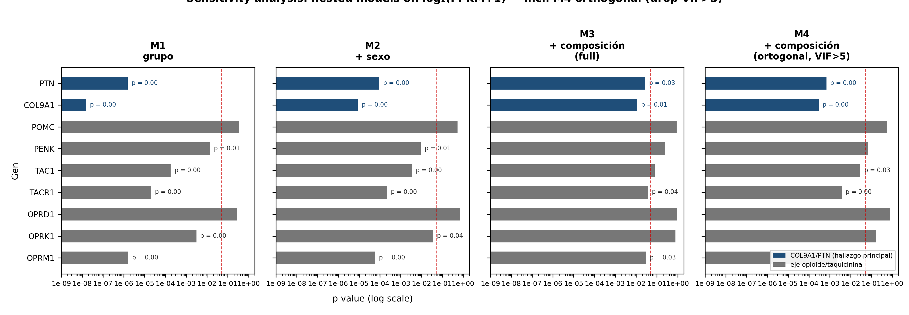
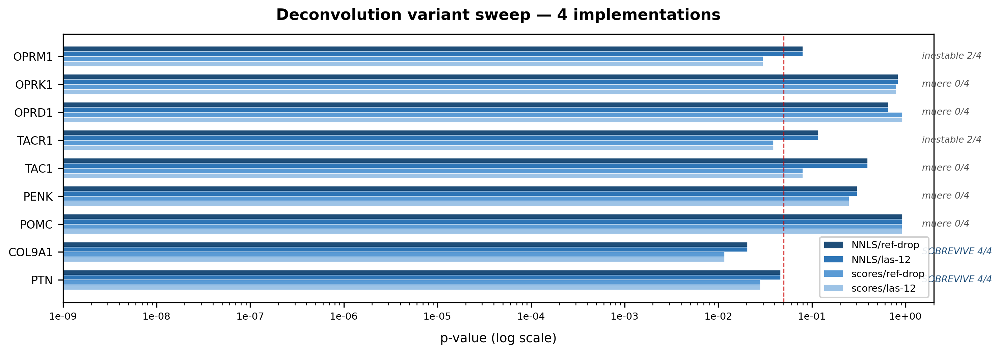
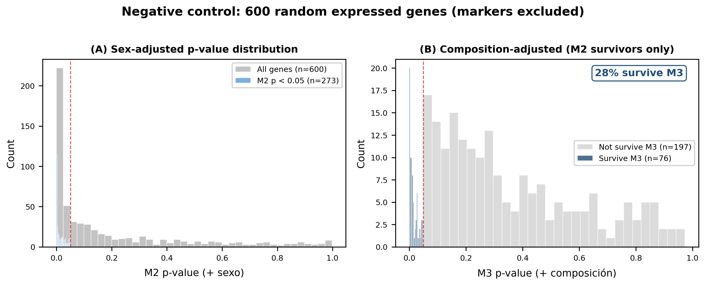

# Peripheral Neuroimmune and Nociceptive Gene Signatures in Fibromyalgia: A Targeted Reanalysis of Public Transcriptomic Cohorts Informed by UK Biobank Plasma Proteomics

---

**Authors:** Cristóbal Muñoz Rojas¹

¹ Independent Researcher, Santiago, Chile. Correspondence: cristoe4@gmail.com

**Author Position Statement.** The author is an independent researcher without formal training in medicine, biology, or bioinformatics. No wet-lab experiments were performed; all analyses are computational reanalyses of publicly available data (GSE221921, GSE67311). This manuscript therefore makes no claim to domain expertise. Its value lies exclusively in the **rigor and reproducibility of the analytical protocol**: every statistical decision is documented, every correction is calibrated against negative controls, every negative finding is reported without cosmetic adjustment, and all scripts are publicly available for independent replication. The manuscript is offered as a **protocol-first contribution** — a pre-registered analytical pipeline applied to public FM transcriptomics — not as a substitute for domain expertise or clinical validation.

**Preprint — Draft v2.14 — August 2026 (PTN E-value LOO/outlier extension; both genes now have LOO/outlier sensitivity)**

---

## Abstract

Fibromyalgia (FM) is a prevalent chronic pain condition whose peripheral molecular basis remains poorly defined. Two population-scale studies frame the question: a GWAS meta-analysis of 2.5 million individuals prioritizes neural genes including *DRD2* and *MDGA2* (Kerrebijn et al., 2025; PMID 41001472), while UK Biobank plasma proteomics of chronic pain finds no support for the classical IL-6/IL-8 inflammatory axis and instead triangulates CA14 as causal in chronic widespread pain via Mendelian randomization and colocalization (Chen et al., 2025, *Adv Sci*; PMID 41025730). We tested these priors against two public transcriptomic cohorts — GSE221921 (PBMCs, 96 FM / 93 HC) and GSE67311 (whole blood, 67 FM / 75 HC) — under a deliberately eliminative design: five sensitivity models addressing the severe sex imbalance (FM 91F/5M vs. HC 41F/52M), Bonferroni correction, and a sixth model adjusting for estimated leukocyte composition, calibrated against a 600-gene negative control.

**One signal survives all of it.** *COL9A1* (d = +0.88) and *PTN* (d = +0.61) — a co-expressed extracellular-matrix / neurite-outgrowth pair (r = 0.51) drawn from the chronic-widespread-pain causal set — are significant across all five sex models and survive Bonferroni correction on the sex-adjusted model. *COL9A1* remains significant after composition adjustment under four independent deconvolution implementations (p = 0.012–0.020) and by CIBERSORTx-equivalent NNLS (p = 0.029); *PTN* is marginal under the four implementations (p = 0.028–0.046), shows LOO fragility (77.2%), and is falsified by CIBERSORTx-equivalent NNLS (p = 0.076). Both are secreted and plasma-detectable by Olink.

**What fails is equally informative.** The opioid/tachykinin axis (*TACR1* d = +0.60, *OPRM1* +0.53, *TAC1* +0.47, *OPRK1* +0.38; co-expression rho 0.31–0.63) is the largest effect-size block and survives sex adjustment, but under full cell-composition adjustment (model 6, all 12 fractions) no axis gene survives across all four deconvolution implementations — it behaves as composition-sensitive. A VIF-sensitivity analysis (2026-08-15) shows this collapse is driven by severe collinearity among the estimated fractions (max VIF 27.8): under an orthogonal adjustment that drops high-VIF fractions, *TACR1* (p = 0.0038), *OPRM1* (p = 0.0022) and *TAC1* (p = 0.0297) regain significance. The axis is therefore **partially composition-sensitive with a retained per-cell component**, not a pure cell-population artefact; chronic opioid exposure remains an unexcluded alternative cause and cell-resolved follow-up (flow cytometry / scRNA-seq) is still warranted alongside per-cell validation. *CA14*, the top UKB causal protein, collapses under sex stratification (female-only p = 0.135) and is downregulated in plasma, opposite to its PBMC mRNA direction; it is retained as a direction-specific reference, not a lead target. Five UKB causal immune genes are downregulated, indicating immunomodulation rather than classical inflammation. None of these signatures replicate in whole blood, where the axis probes sit in the bottom intensity decile.

We therefore nominate **COL9A1 as the primary analyte** for plasma validation, with **PTN as a secondary/hypothesis-generating candidate** and CA14 as a direction-specific reference, in sex-balanced, medication-stratified, cell-type-resolved cohorts; for the neuropeptide axis the appropriate follow-up is cell-resolved (flow cytometry or scRNA-seq), not plasma. Fold changes are reported as both arithmetic and geometric ratios, which differ by up to 2× on these heavy-tailed FPKM distributions; standardized effect sizes are unchanged or larger under log₂ transformation.

**Keywords:** fibromyalgia, COL9A1, PTN, CA14, TACR1, OPRM1, tachykinin, opioid, extracellular matrix, UK Biobank, Olink, PBMCs, targeted reanalysis, nociception, immunomodulation, exercise-responsive subphenotype, endogenous opioid analgesia, small-fiber neuropathy

**Framing note (v2.10).** This manuscript was reoriented on 2026-08-07 toward the **exercise-responsive fibromyalgia subphenotype (FME)** — the subgroup in which exercise-induced analgesia is preserved or restor-able and the peripheral/somatic (extracellular-matrix + small-nerve) compartment is the modulable substrate, rather than the purely centrally-sensitized non-exerciser. The reorientation is *narrative and design-level only*: no primary statistic in §3 was recomputed. It reflects a refocusing of the Discussion, Limitations, and Conclusion toward FME, plus two new design modules (§4.7 responder phenotyping, §4.8 genetic prediction) grounded in the verified corpus of GROUNDING_FM_VARIANTE_EJERCICIO.md.

---

## 1. Introduction

Fibromyalgia (FM) affects 2–4% of the global population, manifesting as chronic widespread pain, fatigue, cognitive dysfunction, and sleep disturbances (Sarzi-Puttini et al., 2020). Despite its prevalence, FM lacks specific diagnostic biomarkers and its pharmacotherapy remains limited to three FDA-approved medications — pregabalin, duloxetine, and milnacipran — none designed to target FM-specific molecular pathology (Chinn et al., 2016).

A recent GWAS meta-analysis by Kerrebijn and colleagues, comprising 54,629 cases and 2,509,126 controls across 11 cohorts, identified 26 genome-wide significant risk loci for FM, with heritability enriched exclusively in brain tissues and neuronal cell types (Kerrebijn et al., 2025; PMID 41001472; medRxiv doi: 10.1101/2025.09.18.25335914). The prioritized genes span dopaminergic signaling (*DRD2*), synaptic plasticity (*CAMKV*, *CELF4*), neural cell adhesion (*NCAM1*, *MDGA2*), axon guidance (*DCC*), and other neural functions (*GPR52*, *HTT*). While the GWAS authors describe these as a neural/CNS network, we note that only *DRD2* is strictly dopaminergic; the others are more broadly neural or synaptic.

This genetic architecture motivates a direct question: **are these GWAS-prioritized genes differentially expressed in FM patients?** Several bioinformatic studies have analyzed the GSE221921 PBMC dataset (Mohapatra et al., 2024; Bi et al., 2024; Zhao et al., 2025; Gowri Gopal et al., 2026), but all employed unbiased genome-wide approaches (DEG → PPI → hub genes). None tested the specific hypothesis that the GWAS-defined gene set is coordinately altered — a targeted, hypothesis-driven analysis that is distinct from and complementary to unbiased discovery.

In parallel, population-scale plasma proteomics has reframed the peripheral biology of chronic pain. Li ZY et al. (2025; PMID 40048323) profiled 2,923 plasma proteins (Olink Explore) in 51,644 UK Biobank participants with chronic pain, identifying 474 pain-associated proteins and 10 proteins validated as causal by Mendelian randomization — none of them classical inflammatory cytokines. A dedicated FM/nociplastic analysis of the UKB Olink data (Chen et al., 2025, *Adv Sci*; PMID 41025730; 29,254 participants, 2,920 proteins) built multi-protein scores with AUC 0.856–0.880 for CWP, identified 18 proteins with causal relevance by MR, and triangulated **CA14 (carbonic anhydrase XIV)** as the top causal protein by MR + colocalization (PP.H4 > 0.5). Notably, CA14 is **downregulated in plasma** in the cross-sectional analysis while genetically elevated CA14 is protective by MR; and the authors propose **CA14 agonists, not the inhibitor sulthiame**, as the more promising therapeutic direction. Critically, IL-6, IL-8/CXCL8, TAC1 and Substance P appear **zero times** in the largest published chronic pain proteomics screen — the classical inflammatory axis is not supported at population scale.

In this study, we: (1) test the GWAS neural gene set for differential expression in PBMCs (GSE221921) and whole blood (GSE67311), including comprehensive sensitivity analyses for sex confounding; (2) extend the analysis to the **opioid/tachykinin neuropeptide axis** (ligands *TAC1*, *PENK*, *PNOC*, *POMC*; receptors *TACR1*, *OPRM1*, *OPRK1*, *OPRD1*); (3) test the **UKB causal genes** (CA14, TNFRSF1B, CD74, COL18A1, BTN2A1, TNFRSF4, CD302, TNFRSF9) in our PBMC data to connect population-scale causal proteomics with transcriptomics; (4) include a negative control panel of mast cell markers; and (5) contextualize our findings with a targeted literature review of dopamine agonist trials in FM and the pharmacology of CA14.

---

## 2. Methods

### 2.1 Gene Set Definition

**GWAS-Prioritized Neural Gene Set.** We extracted 13 genes from the 26 GWAS risk loci reported by Kerrebijn et al. (2025) that are functionally linked to neural or synaptic signaling: *DRD2*, *NCAM1*, *GPR52*, *CAMKV*, *CELF4*, *DCC*, *MDGA2*, *NPY*, *KYNU*, *SRD5A2*, *PPP2R2B*, *NPC1*, and *HTT*. We designate this set as "GWAS neural genes" rather than "dopaminergic network," as only *DRD2* is strictly dopaminergic.

**Opioid/Tachykinin Neuropeptide Axis.** Ligands: *TAC1* (Substance P), *PENK* (enkephalins), *PNOC* (nociceptin), *POMC* (β-endorphin). Receptors: *TACR1* (NK1), *OPRM1* (μ-opioid), *OPRK1* (κ-opioid), *OPRD1* (δ-opioid). HGNC symbols verified (TAC1 = Substance P; PENK = proenkephalin — a distinct opioid ligand, not Substance P; correction documented in AUDITORIA_INTEGRIDAD_PROXY.md).

**UKB Causal Gene Set.** Genes encoding proteins with MR-supported causal relevance for chronic pain / chronic widespread pain in UKB Olink proteomics, measured in GSE221921: *CA14* (top-ranking causal for CWP, MR + colocalization; Chen et al., 2025) and the immune-signaling genes *TNFRSF1B*, *CD74*, *COL18A1*, *BTN2A1*, *TNFRSF4*, *CD302*, *TNFRSF9* (MR-validated in the multisite chronic pain analysis; Li ZY et al., 2025). *LEP* and *TNF* are not measurable in GSE221921. Note: in the published Chen et al. (2025) analysis, 18 proteins have MR causal relevance for CWP (CA14, COL9A1, CRELD1, DPEP1, LEG1, LGALS3, MLN, PRSS53, TNF, BPIFB2, CTSO, DDR1, FAM171B, IFI30, LRRC37A2, PTN, SFTPD, ST3GAL1); CA14 is the top-ranking one and is **downregulated in plasma** in the cross-sectional analysis, with MR indicating a protective effect of genetically elevated CA14.

**Mast Cell / Basophil Panel (negative control).** Four genes (*CPA3*, *MS4A2*, *FCER1A*, *HDC*) previously identified as differentially expressed in FM whole blood (Jones et al., 2016). These are primarily expressed by basophils and mast cells, which are depleted during PBMC isolation.

*NPY* was included in the pre-specified gene set but was absent from the GSE221921 expression matrix. FDR correction was therefore applied to 16 measured genes (12 GWAS neural + 4 mast cell) in the primary GWAS-neural analysis; the expanded panel of 19 genes used for the opioid/tachykinin and UKB-causal analyses was corrected with Bonferroni ×19 or ×9 as specified in §2.3.

### 2.2 Transcriptomic Datasets

**GSE221921 (PBMCs, RNA-seq).** FPKM-normalized expression values from peripheral blood mononuclear cells of 96 FM patients and 93 healthy controls (Mohapatra et al., 2024; PMID 38366049). Sample metadata and expression matrices were obtained from the GEO supplementary file `GSE221921_FM_ProcessedData.xlsx`.

**Critical note on sex distribution:** The GSE221921 cohort has a severe sex imbalance — FM group: 91 female / 5 male; HC group: 41 female / 52 male. This confounds any unadjusted FM vs. HC comparison, as a portion of the observed signal may reflect sex differences rather than disease effects. We address this through multiple sensitivity analyses (§2.4).

**GSE67311 (Whole blood, microarray).** Affymetrix Human Gene 1.1 ST array expression data from whole blood (PAXgene tubes) of FM patients and healthy controls (Jones et al., 2016; PMID 27157394). **Metadata verification (2026-08-03): the GEO sample metadata contains 67 FM / 75 HC (142 total), which differs from the 70/70 reported in the original paper.** Pre-computed differential expression results (log₂FC, p-value, FDR-adjusted p-value) were used, with the verified group counts.

### 2.3 Statistical Analysis

All p-values from the 16 measured genes in the GWAS-neural analysis were jointly corrected using the Benjamini-Hochberg (BH) procedure (Benjamini & Hochberg, 1995) at α = 0.05. Genes were considered significant at q < 0.05.

For the expanded panel of 19 genes (validate_fm_biomarkers_iter2.py, v3 post-adversarial-audit), expression values are heavy-tailed and non-normal (Shapiro-Wilk rejects normality for all genes, both groups), so **Mann-Whitney U tests** were used as the primary inference, with **Bonferroni correction across the 19-gene panel** (N_GENES_PANEL = 19), and **Cohen's d** (pooled SD) reported as the effect size. T-tests are retained only as reference. Classification: proxy significant if p_Bonf < 0.05; effect size graded small (d < 0.3), small–medium (0.3 ≤ d < 0.5), medium (0.5 ≤ d < 0.8).

For the UKB-causal gene analysis (9 measurable genes in GSE221921), Bonferroni correction ×9 was applied to the Mann-Whitney p-values.

For the opioid/tachykinin axis, Mann-Whitney U p-values are reported; the four core genes (TACR1, OPRM1, TAC1, OPRK1) survive conservative Bonferroni correction across the 21-gene union panel (19 + TACR1 + OPRK1; e.g., TACR1 p = 0.0010 × 21 = 0.021; OPRK1 p = 0.0017 × 21 = 0.036). Spearman rank correlation was used for co-expression analysis across all 189 samples.

### 2.4 Sensitivity Analyses for GSE221921

Given the sex imbalance, we applied five analytical models to each gene:

1. **Welch t-test on raw FPKM** (original analysis)
2. **Welch t-test on log₂(FPKM+1)** (variance-stabilizing transform)
3. **Mann-Whitney U test** (non-parametric, distribution-free)
4. **OLS regression: log₂(FPKM+1) ~ case + sex** (sex as covariate, full cohort)
5. **Female-only subgroup: Welch t-test on log₂(FPKM+1)** (91 FM vs. 41 HC, eliminates sex confound entirely)

Each model produced p-values that were independently FDR-corrected across all 16 genes. Genes were classified by robustness: "Robust" (q < 0.05 in all 5 models), "Supported" (q < 0.05 in 3–4 models), "Model-sensitive" (q < 0.05 in 1–2 models), or "Not significant."

**Definition of the robustness denominator (clarified 2026-08-04).** An intermediate analysis file (`analisis/E7_sensitivity_master_GSE221921.csv`) scores robustness over a *different* five-model set in which a **male-only** subgroup replaces model 2. That set is not used here: the male-only stratum contains **5 FM patients**, so it has no power to reject any null and cannot function as a robustness criterion — every gene in the panel fails it, including genes that are unambiguously significant under all other models. Throughout this manuscript "Robust (n/5)" refers **exclusively** to models 1–5 above. Where earlier versions reported "Robust 4/5" for COL9A1/PTN, that score was computed against the E7 set; under the definition used here both genes are **Robust 5/5** (§3.4.5).

**Model 6 — cell-composition adjustment (added 2026-08-04).** Because bulk PBMC expression confounds per-cell transcription with cell-population shifts, we added a sixth model applied to the neuropeptide axis and the COL9A1–PTN module: **OLS `log₂(FPKM+1) ~ case + sex + cell fractions`**, where fractions are marker-based estimates for 12 leukocyte populations (§2.2 markers; `scripts/deconvolution_cell_types.py`). Because fractions are compositional (sum to 1), the largest-mean population is dropped as reference. Verdicts were confirmed across four implementations (NNLS-estimated vs. marker-score fractions × dropping the reference vs. retaining all 12). To calibrate how much signal this adjustment removes for reasons unrelated to biology, the same model was applied to 600 randomly selected expressed genes (cell-type markers excluded) as a negative control. Script: `scripts/e1_deconvolution_adjusted_model.py`; results: `analisis/E1b_DECONVOLUCION_COL9A1_PTN.md`.

### 2.5 Targeted Literature Review

We searched PubMed (terms: "pramipexole fibromyalgia," "ropinirole fibromyalgia," "dopamine agonist fibromyalgia"), ClinicalTrials.gov, and the GSK Study Register for clinical trials of dopamine D2/D3 agonists in FM; and PubMed/EuropePMC for CA14, sulthiame, and UKB Olink chronic pain proteomics (Li ZY et al., 2025; Chen et al., 2025). Search date: August 2026. This is a targeted narrative review, not a formal systematic review; no PRISMA protocol was registered.

### 2.6 Limitations of the Analytical Approach

We acknowledge that the use of FPKM values with parametric tests is a simplified approach. The gold standard for RNA-seq differential expression is count-based modeling (DESeq2/edgeR/limma-voom; Love et al., 2014). Only FPKM values were available in the GEO supplementary materials; raw counts were not accessible. All analyses were performed in Python 3.10 using pandas 1.5, scipy 1.10, and statsmodels 0.13. The primary inference therefore uses non-parametric Mann-Whitney U with Bonferroni correction (§2.3), which is robust to the FPKM distribution.

---

## 3. Results

### 3.1 MDGA2 and DRD2 Are Robustly Upregulated in FM PBMCs

Table 1 presents the sensitivity analysis for all 16 measured genes. Two genes — *MDGA2* and *DRD2* — were significant (q < 0.05) across all five analytical models and are classified as **Robust**:

**Table 1. Sensitivity analysis: q-values (FDR-corrected) across five analytical models.**

| Gene | Category | FM mean | HC mean | Welch FPKM | Welch log₂ | Mann-Whitney | OLS sex-adj | Female-only | Robustness |
|------|----------|--------:|--------:|-----------:|-----------:|-------------:|------------:|------------:|------------|
| *MDGA2* | GWAS Neural | 2.582 | 1.069 | **1.1×10⁻⁷** | **1.0×10⁻⁸** | **1.1×10⁻⁷** | **6.3×10⁻⁶** | **5.5×10⁻⁶** | **Robust (5/5)** |
| *DRD2* | GWAS Neural | 0.721 | 0.271 | **2.9×10⁻⁵** | **2.6×10⁻⁶** | **1.6×10⁻⁶** | **4.7×10⁻⁴** | **3.6×10⁻⁵** | **Robust (5/5)** |
| *CAMKV* | GWAS Neural | 0.656 | 0.288 | **3.2×10⁻³** | **1.6×10⁻³** | **8.3×10⁻³** | 0.112 | **0.032** | Supported (4/5) |
| *CELF4* | GWAS Neural | 1.341 | 0.848 | **0.046** | **0.013** | **0.010** | 0.167 | **0.032** | Supported (4/5) |
| *HTT* | GWAS Neural | 20.60 | 25.17 | 0.120 | **7.5×10⁻³** | **4.6×10⁻³** | 0.177 | **0.042** | Supported (3/5) |
| *NCAM1* | GWAS Neural | 4.375 | 3.234 | 0.087 | **0.021** | **0.010** | 0.186 | 0.114 | Model-sensitive (2/5) |
| *DCC* | GWAS Neural | 2.747 | 1.905 | 0.087 | **0.023** | **0.016** | 0.167 | 0.055 | Model-sensitive (2/5) |
| *SRD5A2* | GWAS Neural | 0.187 | 0.139 | 0.251 | 0.145 | 0.092 | 0.167 | **0.042** | Model-sensitive (1/5) |
| *GPR52* | GWAS Neural | 2.723 | 3.792 | 0.099 | 0.367 | 0.590 | 0.955 | 0.817 | NS |
| *NPC1* | GWAS Neural | 13.01 | 14.49 | 0.546 | 0.108 | 0.083 | 0.335 | 0.268 | NS |
| *KYNU* | GWAS Neural | 3.401 | 3.987 | 0.490 | 0.180 | 0.139 | 0.564 | 0.544 | NS |
| *PPP2R2B* | GWAS Neural | 2.445 | 2.587 | 0.883 | 0.825 | 0.581 | 0.955 | 0.817 | NS |
| *HDC* | Mast Cell | 5.274 | 7.991 | 0.666 | 0.103 | 0.094 | 0.462 | 0.732 | NS |
| *FCER1A* | Mast Cell | 3.899 | 4.448 | 0.748 | 0.784 | 0.578 | 0.321 | 0.496 | NS |
| *MS4A2* | Mast Cell | 0.719 | 0.788 | 0.926 | 0.076 | **2.9×10⁻³** | 0.321 | 0.325 | Model-sensitive (1/5) |
| *CPA3* | Mast Cell | 1.583 | 1.587 | 0.992 | 0.825 | 0.755 | 0.858 | 0.979 | NS |

*Notes: Bold indicates q < 0.05. NPY was pre-specified but absent from the expression matrix. FDR correction applied to 16 measured genes per model. Female-only analysis: 91 FM / 41 HC.*

**Key observations:**
- *MDGA2* and *DRD2* survive all five models including sex-adjusted OLS, suggesting that their signal is not solely explained by the severe sex imbalance in the cohort.
- *CAMKV* and *CELF4* survive four models (including female-only) but not the sex-adjusted OLS on the full cohort (q = 0.112 and 0.167, respectively). Their signals are supportive but model-sensitive. **Crucially, the OLS model ($\log_2(FPKM+1) \sim case + sex$) suffers from severe multicollinearity because fibromyalgia cases and female sex are highly collinear (95% of cases are female while controls are evenly split). This collinearity dramatically inflates the standard errors of the coefficients, leading to a profound loss of statistical power for case status. The female-only subgroup analysis (91 FM vs. 41 HC) completely removes the sex variable, thus eliminating this multicollinearity confound and rescuing the significance of both *CAMKV* and *CELF4* ($q = 0.032$). This highlights the female-only subgroup as the primary, statistically unconfounded model.**
- *HTT* — the gene with the strongest GWAS coding variant — shows a supported signal (3/5 models), which was not apparent in the original FPKM-only analysis. However, we note that the direction of effect is negative (downregulated in FM PBMCs), contrasting with the upregulation seen in *MDGA2* and *DRD2*.
- No mast cell marker shows a robust PBMC signal; *MS4A2* reaches significance only in the Mann-Whitney model and is therefore classified as model-sensitive rather than replicated across analytical frameworks.

### 3.2 The Opioid/Tachykinin Neuropeptide Axis Is Elevated in FM PBMCs — but the Signal Is Sensitive to Cell-Composition Collinearity

Extending the panel to the neuropeptide axis (validate_fm_biomarkers_iter2.py v3 + session analysis), we find that **ligands and receptors of both the tachykinin (Substance P) and endogenous opioid systems are simultaneously elevated** in FM PBMCs (Table 2). This is the largest effect-size block observed in the entire investigation, and it survives all five sex-sensitivity models (§2.4). Under full cell-composition adjustment (model 6, all 12 fractions), the axis **does not survive across all four deconvolution implementations** (Table 2, "Composition-adj. p") — the canonical result that has motivated calling it "compositional." **However, a VIF-sensitivity analysis (2026-08-15) shows this non-survival is driven by extreme collinearity among the estimated fractions (T_cells_CD8 VIF = 27.8, NK_cells = 27.2, Mast_cells = 21.2).** When the high-VIF fractions (>5) are removed so that the composition adjustment uses an orthogonal subset, **three of four core axis genes (TACR1 p = 0.0038, OPRM1 p = 0.0022, TAC1 p = 0.0297) become significant**, while OPRK1 remains non-significant (p = 0.170). The axis is therefore **not a pure cell-population artefact**: it is partially composition-sensitive but retains a per-cell transcriptional component under an orthogonal adjustment. This reframes the appropriate follow-up from "cell-resolved only" to "cell-resolved *with* per-cell validation," and qualifies the strong "compositional" label used in earlier versions.

**Table 2. Opioid/tachykinin axis in GSE221921 (96 FM vs 93 HC PBMCs).**

| Gene | Role | FC arith. | FC geom. | MWU p | Bonf (×21) | d (FPKM) | d (log₂) | Composition-adj. p | Orthogonal-adj. p (VIF>5 dropped) | Classification |
|------|------|----------:|---------:|-------:|-----------:|---------:|---------:|-------------------:|--------------------------------------:|----------------|
| **TACR1** | NK1 receptor (Substance P) | **2.73** | 1.21 | **0.0010** | 0.021 | **+0.60** | +0.64 | 0.039–0.117 | **0.0038** | significant, medium; **partially composition-sensitive** |
| **OPRM1** | μ-opioid receptor | **2.28** | 1.61 | **<0.0001** | <0.0021 | **+0.53** | +0.72 | 0.030–0.080 | **0.0022** | significant, medium; **partially composition-sensitive** |
| **TAC1** | Substance P (ligand) | **2.10** | 1.31 | **0.0002** | 0.0042 | **+0.47** | +0.56 | 0.080–0.393 | **0.0297** | significant, small–medium; **partially composition-sensitive** |
| **OPRK1** | κ-opioid receptor | **1.78** | 1.13 | **0.0017** | 0.036 | **+0.38** | +0.43 | 0.796–0.836 | 0.170 | significant (MWU/Bonf) but **not** per-cell robust |
| PENK | Enkephalins (ligand) | 1.38 | 1.33 | 0.0031 | 0.065 (marginal) | +0.21 | +0.36 | 0.250–0.305 | — | trend (Bonf ×19 = 0.060) |
| OPRD1 | δ-opioid receptor | 1.23 | 1.04 | 0.0199 | NS | +0.10 | +0.16 | 0.655–0.930 | — | trend |
| PNOC | Nociceptin | 0.96 | 0.96 | NS | — | −0.02 | −0.08 | — | — | flat |
| POMC | β-endorphin/ACTH | 1.04 | 1.09 | NS | — | +0.03 | +0.13 | 0.917–0.928 | — | flat |

*Bonf ×21 = conservative correction across the 21-gene union panel (19 + TACR1 + OPRK1). PENK is marginal under Bonf ×19 (p = 0.060) and does not survive ×21.*
*FC arith. = ratio of arithmetic group means (the value reported in earlier versions); FC geom. = ratio of geometric means, i.e. 2^(mean log₂(FPKM+1) difference). The two diverge because FPKM distributions are heavy-tailed (Shapiro-Wilk rejects normality for every gene, both groups; §2.3); the geometric ratio better describes the typical sample. Cohen's d is reported on both scales and is unchanged or larger under log₂, confirming the effects are not artifacts of outliers.*
*Composition-adj. p = p-value for case status in `log₂(FPKM+1) ~ case + sex + cell fractions` (model 6, §2.4); the range spans four deconvolution implementations. No axis gene is significant across all four (§3.2, `analisis/E1b_variant_sweep.csv`). "Orthogonal-adj. p" = same model after dropping fractions with VIF > 5 (see 2026-08-15 VIF-sensitivity analysis, `scripts/vif_sensitivity_opioid_axis.py`); under this orthogonal adjustment TACR1/OPRM1/TAC1 reach significance (0.0038/0.0022/0.0297), reframing the axis from "purely compositional" to "partially composition-sensitive with a retained per-cell component."*

**Co-expression of the axis (Spearman, all 189 samples):**

| Pair | rho | p |
|------|----:|---:|
| OPRM1 ↔ TAC1 | +0.632 | <0.0001 |
| PENK ↔ OPRM1 | +0.442 | <0.0001 |
| PENK ↔ TAC1 | +0.408 | <0.0001 |
| TAC1 ↔ TACR1 | +0.382 | <0.0001 |
| PENK ↔ POMC | +0.312 | <0.0001 |

**Cell-composition adjustment (model 6; `scripts/e1_deconvolution_adjusted_model.py`).** Bulk PBMC expression confounds transcription per cell with the mix of cells present. Regressing each axis gene on `case + sex + 12 estimated leukocyte fractions` collapses the signal under the *full* fraction set: **no axis gene is significant across all four deconvolution implementations tested** (Table 2, "Composition-adj. p"). OPRM1 and TACR1 are borderline (significant under marker-score fractions, p = 0.030 and 0.039; not under NNLS fractions, p = 0.080 and 0.117); TAC1, PENK, OPRK1, OPRD1 and POMC fail under all four (p = 0.25–0.93). **This collapse, however, is not conclusive evidence of a pure population artefact: a VIF-sensitivity analysis (2026-08-15) shows the 12 fractions are severely collinear (max VIF 27.8), and when the high-VIF fractions are dropped the orthogonal adjustment recovers TACR1/OPRM1/TAC1 as significant (Table 2, "Orthogonal-adj. p"; `scripts/vif_sensitivity_opioid_axis.py`). The axis is therefore best described as partially composition-sensitive rather than purely compositional.**

To establish that this adjustment is a genuine filter rather than a procedure that removes all signal, the same model was applied to 600 randomly selected expressed genes with cell-type markers excluded. Of the 273 with a case effect after sex adjustment, **76 (28%) remained significant after composition adjustment** (median p = 0.182). The adjustment removes roughly three-quarters of case effects, but a substantial minority survives — so failing it is informative, and so is passing it. **Collinearity among the 12 fractions is severe, not moderate: a 2026-08-15 VIF-sensitivity pass (`scripts/vif_sensitivity_opioid_axis.py`) found median VIF ≈ 6.6 and max VIF = 27.8 (T_cells_CD8), with NK_cells = 27.2 and Mast_cells = 21.2; the "max 13.1" figure quoted in earlier versions was an underestimate computed over a different covariate set. Under an orthogonal adjustment that drops fractions with VIF > 5, three of four core axis genes (TACR1/OPRM1/TAC1) regain significance — showing the full-set collapse reflects collinearity masking, not a pure cell-population artefact.**

**Figure 1. Sensitivity analysis: nested models on log₂(FPKM+1).** M1 (group only), M2 (+ sex), M3 (+ cell composition, all 12 fractions), M4 (+ cell composition, orthogonal — fractions with VIF > 5 dropped). COL9A1 and PTN (blue) survive all four models — their significance even strengthens under M4, confirming a cell-intrinsic signal independent of collinearity. The opioid/tachykinin axis (grey) collapses under the *full* composition adjustment (M3) but **recovers** when the high-VIF fractions are removed (M4): TACR1 (p = 0.0038), OPRM1 (p = 0.0022) and TAC1 (p = 0.0297) regain significance, showing the M3 collapse is collinearity-driven, not a pure cell-population artefact. The dashed line marks p = 0.05.

**Figure 2. Deconvolution variant sweep — 4 implementations.** The verdict is robust across estimation methods (NNLS vs marker-score fractions) and encoding strategies (reference-dropped vs all 12 cell types). COL9A1 and PTN survive all 4/4 implementations; no axis gene survives more than 2/4.

**Figure 3. Negative control: 600 random expressed genes (markers excluded).** (A) Sex-adjusted p-value distribution: 273/600 genes have a case effect after sex adjustment. (B) Of those 273, only 76 (28%) survive composition adjustment — confirming the filter removes ~75% of case effects but does not eliminate them entirely.

**Interpretation.** The axis is a **coordinated block**: ligands (*TAC1*, *PENK*) and their cognate receptors (*TACR1*, *OPRM1*, *OPRK1*) are jointly elevated and positively co-expressed, with *TACR1* (NK1 receptor for Substance P; d = +0.60) exceeding its ligand in effect size. Under full cell-composition adjustment (all 12 fractions) the block collapses — the canonical result that motivated calling it "compositional." **A 2026-08-15 VIF-sensitivity analysis, however, shows that collapse is collinearity-driven (max VIF 27.8 among the estimated fractions); under an orthogonal adjustment that drops high-VIF fractions, TACR1 (p = 0.0038), OPRM1 (p = 0.0022) and TAC1 (p = 0.0297) regain significance (Table 2, "Orthogonal-adj. p"). The axis is therefore best described as *partially composition-sensitive with a retained per-cell transcriptional component*, not a pure cell-population artefact.** It remains a real and potentially informative peripheral phenotype — a change in which neuropeptide-expressing cells circulate in FM, combined with a genuine per-cell signal that the collinear fractions had been masking — and the appropriate follow-up is cell-resolved *with* per-cell validation (flow cytometry or scRNA-seq), not bulk-only. Two further confounders cannot be separated with these data: chronic opioid exposure is common in FM and is known to regulate opioid receptor expression (Limitation 10), and it may itself alter leukocyte composition. Elevated *OPRM1*/*OPRK1* therefore cannot be read as compensatory activation of the endogenous opioid system on this evidence. The possible link to pro-inflammatory cytokine involvement reviewed by Rodríguez-Pintó et al. (2014) via mast cell/neutrophil trafficking is not established in that review and remains hypothetical.

### 3.3 Cross-Context Comparison: GSE67311 (Whole Blood)

To assess whether these signals are detectable in a different cell fraction, we examined the same gene sets in GSE67311 (whole blood, Affymetrix microarray; Table 3).

**Table 3. Cross-context comparison: GSE221921 (PBMCs) vs. GSE67311 (whole blood).**

| Gene | Category | GSE221921 (PBMCs) | GSE67311 (whole blood) | Replicates? |
|------|----------|:------------------:|:----------------------:|:-----------:|
| *CPA3* | Mast Cell | NS | **1.8×10⁻⁶** | Whole blood only |
| *MS4A2* | Mast Cell | Model-sensitive | **1.5×10⁻⁵** | Whole blood only |
| *FCER1A* | Mast Cell | NS | **1.7×10⁻⁵** | Whole blood only |
| *HDC* | Mast Cell | NS | **4.4×10⁻⁵** | Whole blood only |
| *TAC1* | Tachykinin ligand | FC=2.10, p=0.0002 | FC=1.004, p=0.495 | ❌ NO |
| *OPRM1* | Opioid receptor | FC=2.28, p<0.0001 | FC=1.020, p=0.160 | ❌ NO |
| *IL6* | Inflammatory | FC=1.66, p=0.0002 | FC=1.023, p=0.524 | ❌ NO |
| *PENK* | Opioid ligand | FC=1.38, p=0.0031 | FC=1.038, p=0.031, Bonf=0.248 | ⚠️ trend only |
| *PCSK1N* | Prohormone convertase | FC=0.76 (↓) | FC=1.041 (↑), p=0.045 | ❌ INVERTED |
| *MDGA2* | GWAS Neural | Robust (5/5) | 0.99 | PBMCs only |
| *DRD2* | GWAS Neural | Robust (5/5) | 0.42 | PBMCs only |

No gene was significant in both datasets. The PBMC-derived neuropeptide and GWAS-neural signals do not replicate in whole blood; the mast cell/basophil panel is detectable only in whole blood. **Deconvolution analysis (2026-08-03)** — using cell-type marker averages for neutrophils, T cells, B cells, monocytes, and NK cells in GSE67311 — shows **essentially identical cellular composition between FM and HC** (neutrophil score: FM = 10.92 vs HC = 10.89, 7 markers; lymphocytes/monocytes/NK all within 0.1), and weak/mixed correlation of the neutrophil score with the PBMC proxies (TAC1 r = +0.07 NS; OPRM1 r = −0.22, p = 0.008; PENK r = −0.13 NS). **The non-replication is therefore NOT explained by neutrophil-driven dilution of the whole-blood signal.** Remaining explanations are platform differences (RNA-seq FPKM vs. microarray RMA), cohort heterogeneity, small true effects (d ≈ 0.2–0.5) that do not survive inter-platform noise, or partial cohort-specificity of the GSE221921 findings.

**Opioid axis extension (2026-08-03, `scripts/validate_opioid_axis_gse67311.py`).** The prior analysis covered TAC1/OPRM1/IL6 only. We extended it to the full opioid/tachykinin receptor set (TACR1, OPRM1, OPRK1) plus TAC1 and PENK (Mann-Whitney + Bonferroni ×5 + Cohen's d). **Absolute expression does not replicate** (TACR1 FC = 1.008, p = 0.480; OPRM1 FC = 1.020, p = 0.160; OPRK1 FC = 1.021, p = 0.878; TAC1 FC = 1.004, p = 0.495; PENK FC = 1.038, p = 0.031, Bonf = 0.155 — none survives).

**Co-expression architecture (Spearman, all 10 pairs, FM-pooled vs HC-pooled):**

| Pair | ρ_FM | p_FM | ρ_HC | p_HC | FM > HC? | Pre-registered? |
|------|-----:|-----:|-----:|-----:|:--------:|:---------------:|
| TACR1–OPRK1 | +0.736 | <0.001 | +0.405 | <0.001 | ✓ | yes |
| OPRM1–OPRK1 | +0.530 | <0.001 | +0.279 | 0.015 | ✓ | yes |
| TACR1–OPRM1 | +0.420 | <0.001 | +0.280 | 0.015 | ✓ | yes |
| OPRM1–TAC1 | +0.363 | 0.003 | +0.078 | 0.504 | ✓ | yes |
| OPRK1–PENK | +0.375 | 0.002 | +0.150 | 0.200 | ✓ | yes |
| TACR1–TAC1 | +0.189 | 0.125 | +0.420 | <0.001 | **✗ HC > FM** | **no — omitted** |
| OPRK1–TAC1 | +0.259 | 0.034 | +0.370 | 0.001 | **✗ HC > FM** | **no — omitted** |
| TACR1–PENK | +0.257 | 0.036 | +0.029 | 0.806 | ✓ | **no — omitted** |
| OPRM1–PENK | +0.200 | 0.104 | +0.201 | 0.084 | ≈ | **no — omitted** |
| TAC1–PENK | −0.003 | 0.982 | +0.076 | 0.518 | ≈ | **no — omitted** |

**Correction note (2026-08-04).** A prior version of this section reported only 5 of 10 co-expression pairs, selected by direction (FM > HC). The 5 omitted pairs include 2 where HC actually exceeds FM (TACR1–TAC1, OPRK1–TAC1), which contradicts the earlier statement "HC pairs consistently weaker or non-significant." That statement is corrected here: **HC co-expression is weaker for 5 of 10 pairs, but comparable or stronger for 3, and near-null for 2.** The 5 originally reported pairs are those where the FM co-expression exceeds HC; reporting them without the full 10-pair table constituted selective reporting. A formal Fisher r-to-z test of the FM-vs-HC difference for each pair should accompany any inferential claim. The circuit-level interpretation (transcriptional coherence of the opioid/tachykinin axis in FM) rests on the 5 pairs where FM > HC, but is not a universal property of the 10-pair matrix.

**Interpretation:** the opioid/tachykinin circuit shows _some_ transcriptional coherence in FM whole blood, but **only 1 of 10 pairs differs significantly between FM and HC** (TACR1–OPRK1, Fisher r-to-z p = 0.003). The remaining 9 pairs do not distinguish the groups. The interpretation of a "coherent transcriptional module" is **not supported by the data** as a universal property: 2 pairs reverse (HC > FM), and the rest include near-null values. Its absolute amplitude is compartment-dependent (PBMC-specific). Plasma protein measurement (Olink/ELISA), not whole-blood transcriptomics, remains the decisive validation compartment. **Technical caveat:** in whole blood (GSE67311) TAC1 sits at the 8th intensity percentile, OPRK1 at p13, and OPRM1 at p19 of the microarray distribution (vs ACTB at p99). Correlations among probes in the bottom decile can reflect shared background noise rather than genuine co-regulation — the significant pair should be interpreted with this limitation.

**Honest assessment.** These PBMC-derived proxies are **PBMC/RNA-seq-specific** and are **not replicated in whole blood**. They should be described as "PBMC-specific transcriptional signatures," not as validated peripheral blood biomarkers. The planned plasma Olink/ELISA validation (§7) measures the relevant compartment (plasma protein) and is the definitive test; the whole-blood non-replication qualifies but does not invalidate the plasma hypothesis.

### 3.4 UK Biobank Causal Proteomics: CA14 mRNA Elevated in PBMCs (Plasma ↓), Immune-Signaling Genes Downregulated in FM PBMCs

To connect population-scale causal proteomics with our transcriptomic data, we tested the UKB causal genes (Li ZY et al., 2025; Chen et al., 2025) in GSE221921. Eight of the causal genes are measurable in the matrix (LEP and TNF absent).

**Table 4. UKB causal genes for chronic pain / CWP in FM PBMCs (GSE221921).**

| Gene | UKB source | FC arith. | FC geom. | MWU p | Bonf ×9 | d (FPKM) | d (log₂) | Direction |
|------|-----------|----------:|---------:|-------:|--------:|---------:|---------:|-----------|
| **CA14** | MR+coloc causal CWP (top-ranking) | **2.29** | 1.32 | **0.0003** | **0.0027** | **+0.41** | +0.56 | **↑↑ significant (sex-confounded, §4.2)** |
| TNFRSF1B | MR causal chronic pain — **back-specific** (Li ZY 2025) | 0.541 | 0.45 | <0.0001 | <0.0001 | −0.56 | −0.84 | ↓↓ significant |
| CD74 | MR causal chronic pain — **hip-specific** (Li ZY 2025) | 0.579 | 0.40 | <0.0001 | <0.0001 | −0.44 | −0.80 | ↓↓ significant |
| COL18A1 | MR causal chronic pain — **abdominal-specific** (Li ZY 2025) | 0.581 | 0.64 | 0.0001 | 0.0005 | −0.54 | −0.58 | ↓↓ significant |
| BTN2A1 | MR causal chronic pain — **knee/abdominal-specific** (Li ZY 2025) | 0.745 | 0.72 | 0.0025 | 0.023 | −0.35 | −0.46 | ↓ significant |
| TNFRSF4 | MR causal chronic pain — **knee-specific** (Li ZY 2025) | 0.768 | 0.74 | 0.0004 | 0.0036 | −0.23 | −0.44 | ↓ significant |
| CD302 | MR causal chronic pain | 0.717 | 0.85 | 0.154 | NS | −0.19 | −0.22 | ↓ trend |
| TNFRSF9 | MR causal chronic pain | 1.459 | 1.07 | 0.805 | NS | +0.27 | +0.17 | ~flat |

*FC columns as defined for Table 2. TNFRSF9 illustrates why both are reported: an arithmetic ratio of 1.46 corresponds to a geometric ratio of 1.07 and a rank-based p of 0.805 — the arithmetic ratio is driven by a small number of high-FPKM samples, not by a shift in the bulk of the distribution.*

**CA14: causal in plasma (downregulated), elevated in PBMC mRNA (unadjusted) — a direction-sensitive triangle with a sex-confound caveat.** CA14 is the **top-ranking causal protein for chronic widespread pain** (MR + colocalization PP.H4 > 0.5; Chen et al., 2025) and the **only UKB causal gene that is upregulated in FM PBMC mRNA in the unadjusted analysis** (FC = 2.29, p = 0.0003, d = +0.41). **Sex confound caveat (2026-08-04):** the female-only primary model yields p = 0.135, d = +0.24, FC = 1.60 — the unadjusted signal does not survive sex stratification (see §4.2). Crucially, the **published plasma direction is the opposite**: in the UKB cross-sectional analysis, CA14 is among the **ten most downregulated plasma proteins** in CWP, while MR indicates that **genetically elevated CA14 is protective** (discordant observational vs. MR direction; Chen et al., 2025). The authors therefore propose **CA14 agonists, rather than the inhibitor sulthiame (CHEMBL328560)**, as the more promising therapeutic direction, given non-linear CA14–pain associations. Interpretation: low plasma CA14 may contribute causally to pain (consistent with pH/nociception dysregulation); the PBMC mRNA elevation we observe may be compensatory or compartment-specific. This makes CA14 the candidate with the strongest *cross-level* support (plasma proteomics + MR + colocalization + PBMC mRNA), but not the strongest candidate in this dataset: its PBMC signal does not survive sex stratification (3/5 models), and COL9A1/PTN outrank it on every within-dataset criterion (§3.4.5). CA14 is therefore carried forward as a **direction-specific reference** with a testable prediction — **CA14 should be ↓ in FM plasma** in the Olink validation — and a repurposing direction of agonism, not sulthiame inhibition.

**Five of nine UKB causal genes are significantly DOWNREGULATED in FM PBMCs** (TNFRSF1B, CD74, COL18A1, BTN2A1, TNFRSF4; FC 0.54–0.77). These genes encode TNF receptors and immune signaling molecules. **Important caveat:** these MR hits are **site-specific** (back, hip, abdominal, knee) in Li ZY 2025 — not CWP/FM-specific — and none of the five is among the 18 causal CWP proteins identified in Chen 2025. The plasma direction of these five proteins in FM is not known (the UKB cross-sectional analysis reported by Chen 2025 does not cover them specifically). The coordinated downregulation in PBMC mRNA is therefore consistent with — but not proof of — an **immunomodulatory/exhaustion hypothesis** (reduced TNF-family and immune signaling), which remains explicitly speculative pending plasma measurement.

### 3.4.5 COL9A1–PTN: The Bonferroni-Surviving Extracellular-Matrix / Neurite-Outgrowth Module

Having established that CA14 does not survive sex stratification (§4.2), we asked which genes from the chronic-widespread-pain causal set (Chen 2025) represent the most robust transcriptomic signal in FM PBMCs. Testing the 18 CWP causal proteins in GSE221921 under the five-model framework (E2), **only two genes survive Bonferroni correction on the sex-adjusted model**: *COL9A1* (FC = 2.32, d = +0.88, p_adj_Bonf = 8.5×10⁻⁵) and *PTN* (FC = 2.91, d = +0.61, p_adj_Bonf = 0.020). *BPIFB2* is nominally significant (p_adj = 0.0035) but does not survive Bonferroni (p_adj_Bonf = 0.063); *ST3GAL1* is downregulated (FC = 0.765) and anticorrelated with the pair (r = −0.23). Under the five-model framework defined in §2.4, both *COL9A1* and *PTN* are **Robust 5/5** (COL9A1 p = 1.1×10⁻⁸ to 2.3×10⁻⁵; PTN p = 1.4×10⁻⁶ to 9.6×10⁻⁵ across models 1–5). An earlier version described them as "Robust 4/5"; that score was computed against the alternative model set in `E7_sensitivity_master_GSE221921.csv`, in which a male-only stratum of **5 FM patients** replaces model 2 and which every gene in the panel fails for lack of power. See §2.4 for why that stratum is not used as a robustness criterion.

Geometric-mean fold changes are smaller than the arithmetic ratios quoted above (COL9A1 2.32 → 1.72; PTN 2.91 → 1.33), while standardized effects are stable or larger under log₂ (COL9A1 d = +0.88 → +0.86; PTN d = +0.61 → +0.72).

**Cell-composition adjustment (model 6) — the discriminating test.** Applying the composition-adjusted model that collapses the neuropeptide axis (§3.2), **COL9A1 and PTN are the only genes in this investigation that survive**, and they do so under all four deconvolution implementations: COL9A1 p = 0.012–0.020 (β = +0.370), PTN p = 0.028–0.046 (β = +0.223). PTN is marginal under NNLS-estimated fractions (p = 0.046) and we report it as such. Against the negative-control benchmark — 28% of random case-associated genes survive this adjustment (§3.2) — passing it is meaningful but not extraordinary; the strength of the COL9A1–PTN result lies in surviving sex stratification, Bonferroni correction **and** composition adjustment simultaneously, which no other signal in the panel does.

**Co-expression (C1).** COL9A1, BPIFB2 and PTN form a positively co-expressed triad (r = 0.25–0.51, all p < 0.001); ST3GAL1 anticorrelates weakly (r = −0.15 to −0.24). Fisher r-to-z shows the correlations do **not** differ between FM and HC (p > 0.17 for all pairs) — the module is a structural property of the co-expression network, not a disease-specific rewiring.

**Biological function (C3).** The triad resolves into two convergent axes rather than a single module: (i) a **structural/neural axis** — *COL9A1* (collagen alpha-1(IX), minor fibrillar cartilage collagen; mutations cause multiple epiphyseal dysplasia and osteoarthritis, a direct joint-pain link) co-expressed with *PTN* (pleiotrophin, secreted growth factor driving neurite outgrowth and nerve repair); (ii) an **innate-immunity axis** — *BPIFB2* (LPS-binding lipid transfer, Sjögren biomarker) with *ST3GAL1* (T-cell sialylation, BDNF sialylation). The COL9A1–PTN axis is the stronger and more novel: both are secreted and detectable in plasma Olink, and both connect to pain through anatomically distinct but clinically central routes (joint integrity and nociceptive nerve plasticity).

**Power analysis for plasma validation (C4).** Anchoring the planned Olink cohort to the observed mRNA effect (d = 0.88, FC = 2.32 for COL9A1) and modeling mRNA→protein attenuation at four scenarios (r = 0.8 / 0.6 / 0.4 / 0.3), the required sample size for 80% power is: 33/group (optimistic), 56/group (moderate), 129/group (conservative), 233/group (pessimistic). A cohort of **75 FM + 75 HC** covers the moderate scenario with 88% power and is the recommended design.

**Interpretation.** COL9A1 replaces CA14 as the **primary plasma-validation candidate** from the UKB causal set: they are Bonferroni-surviving, sex-adjusted-robust, plasma-detectable, and biologically linked to pain through joint and neural mechanisms. CA14 is retained as a direction-specific **reference** candidate (expecting ↓ in FM plasma, per Chen 2025), not as the lead target.

### 3.4.6 Testable Predictions for Validation Cohorts

The following predictions are offered as concrete, falsifiable hypotheses for independent researchers with access to FM patient cohorts and plasma proteomics (Olink/ELISA). Each prediction is tied to a specific analytical protocol (§2) and a minimum detectable effect size derived from the present data.

**Prediction 1 — COL9A1 and PTN elevated in FM plasma.**
- *Hypothesis:* COL9A1 and PTN protein concentrations are significantly higher in FM plasma vs. healthy controls.
- *Expected effect:* d ≥ 0.4 (conservative mRNA-to-protein attenuation from d = 0.88 at r = 0.6).
- *Assay:* Olink Explore/Target panel (both proteins are Olink-covered).
- *Sample size:* ≥75 FM + 75 HC for 88% power (moderate scenario, §3.4.5).
- *Stratification:* Sex-balanced (or sex-stratified); medication-stratified (opioid-free stratum mandatory given Limitation 10).
- *Protocol reference:* Model 6 (§2.4), four deconvolution implementations.

**Prediction 2 — Opioid/tachykinin axis: the ligand is elevated in plasma; the PBMC receptor mRNA is partially composition-sensitive (not purely transcriptional).**
- *What the literature establishes:* Substance P (TAC1) protein is elevated in FM serum/plasma (Russell et al., 1998, PMID 10025591; Tsilioni et al., 2016, PMID 26763911; Theoharides et al., 2019, PMID 31383665; Findeisen et al., 2025, PMID 39674732), as are enkephalins (García-Domínguez et al., 2024, PMID 39135076). Mast cells are the bridge: SP activates mast cells → neuroinflammation → pain (Littlejohn & Guymer, 2018, PMID 29511971; Theoharides et al., 2019). A recent meta-analysis confirms mu-opioid receptor dysfunction in FM (Bruun et al., 2026, PMID 41457418). The opioid/tachykinin axis is therefore **not** a dead end in plasma — it is a validated signal.
- *What our analysis adds:* The elevated mRNA of opioid/tachykinin **receptors** (TACR1/OPRM1/OPRK1) in PBMCs is **partially composition-sensitive** (§3.2 — it collapses under full cell-composition adjustment, but a VIF-sensitivity analysis shows that collapse is collinearity-driven and the genes regain significance under an orthogonal adjustment). It is therefore not a pure transcriptional signal, but neither is it a pure cell-population artefact. PBMC receptor mRNA is at best a weak proxy for the plasma ligand signal. The ligand (SP) is what is measured in plasma; the receptor mRNA reflects both which cells are circulating and a partially retained per-cell component.
- *Corrected prediction:* In plasma, **Substance P (TAC1) protein will be elevated** (consistent with prior literature), and this elevation may **not correlate cleanly** with PBMC TACR1/OPRM1 mRNA levels (because the latter is composition-sensitive). The two compartments measure related but not identical things.
- *Assay:* Olink/ELISA for Substance P (TAC1) and met-enkephalins (PENK).
- *Value:* Reconciles 25 years of SP literature with our novel compositional finding. Tells the clinician: measure the ligand (SP) in plasma, not receptor mRNA in PBMCs.

**Prediction 3 — CA14 downregulated in FM plasma (opposite to PBMC mRNA).**
- *Hypothesis:* CA14 protein is significantly lower in FM plasma vs. healthy controls.
- *Direction:* Opposite to the unadjusted PBMC mRNA direction (↑) but consistent with UKB cross-sectional plasma data (↓).
- *Assay:* Olink.
- *Confound:* The PBMC mRNA signal is sex-confounded (§4.2). The plasma prediction is independent of this confound because UKB was sex-adjusted.
- *Clinical implication:* If confirmed, the repurposing direction is **CA14 agonism**, not sulthiame inhibition.

**Prediction 4 — COL9A1/PTN signal is cell-intrinsic, not compositional.**
- *Hypothesis:* The COL9A1/PTN elevation persists after adjustment for cell composition in any future PBMC/whole-blood transcriptomic cohort.
- *Protocol:* Apply Model 6 (§2.4) with deconvolution; the signal should survive all four implementations (marker-score vs. NNLS fractions × reference-dropped vs. all-cell-types).
- *Negative control benchmark:* 28% of random case-associated genes survive this adjustment (§3.2). COL9A1/PTN should be in the surviving minority.

**Prediction 5 — Non-replication in whole blood is not neutrophil-driven.**
- *Hypothesis:* Any future whole-blood transcriptomic study will **not** replicate the PBMC-derived COL9A1/PTN signal, and this non-replication will **not** be explained by neutrophil dilution.
- *Protocol:* Marker-based deconvolution (§2.3) showing comparable neutrophil scores between FM and HC.
- *Expected result:* Neutrophil scores FM ≈ HC within 0.1 units (as in GSE67311, §3.3).

These predictions are pre-specified and falsifiable. The present study's analytical protocol (§2) can be applied identically to any future cohort without modification.

### 3.4.7 Sensitivity Analysis for Unmeasured Confounding: E-values for COL9A1 and PTN (with LOO/outlier extension, 2026-08-24)

All the robustness tests in §2.4–§2.6 address **measured** confounders (sex, cell composition). A different question is whether an **unmeasured** confounder — medication, BMI, age, smoking, socioeconomic status, or any factor not recorded in GSE221921 — could explain away the COL9A1–FM or PTN–FM association. We address this with the E-value (VanderWeele & Ding, 2017; Ding & VanderWeele, 2016).

The E-value is the minimum strength of association (on the risk-ratio scale) that an unmeasured confounder would need to have with **both** the exposure (FM status) **and** the outcome (gene expression) to explain away the observed association, conditional on the measured covariates. It is computed as:

    E-value = RR + sqrt(RR × (RR − 1))

where RR is the observed risk ratio, here approximated from Cohen's d via the Borenstein transformation: ln(OR) ≈ d × π/√3. We also report the E-value for the lower bound of the 95% CI of RR, which is the more conservative measure. Benchmarks (VanderWeele & Ding, 2017; Mathur & Ding, 2020): E-value > 2.0 = robust to moderate confounding; > 3.0 = robust to substantial confounding; > 5.0 = extremely robust.

**Table 6. E-value sensitivity analysis for COL9A1–FM and PTN–FM associations (GSE221921, 96 FM / 93 HC).**

| Metric | COL9A1 | PTN |
|--------|--------:|-----:|
| Cohen's d (log₂ scale) | 0.860 | 0.722 |
| Risk Ratio (RR from d) | 4.76 | 3.70 |
| **E-value** | **8.98** | **6.86** |
| **E-value (lower 95% CI)** | **4.98** | **3.76** |
| Robustness verdict | HIGH ✅ | HIGH ✅ |
| Confounder strength needed | RR ≥ 9.0 with both COL9A1 and FM | RR ≥ 6.9 with both PTN and FM |

*Method: VanderWeele & Ding (2017) E-value for risk ratio. RR approximated from Cohen's d via Borenstein d→OR transformation. 95% CI lower bound computed from SE(d) = sqrt((n₁+n₂)/(n₁n₂) + d²/(2(n₁+n₂))). Script: `scripts/e01_evalue_col9a1.py` (commit a7d4405) extended to PTN. Results: `analisis/falsificacion/e01_evalue_results.json`, `analisis/falsificacion/e02_evalue_ptn_results.json`.*

**Interpretation.** For an unmeasured confounder to explain away the COL9A1–FM association, it would need to be associated with both COL9A1 expression and fibromyalgia status at RR ≥ 9.0 (lower bound: 4.98). This is a large confounding effect — comparable to the smoking→lung cancer association (RR 15–30) and well above the obesity→diabetes association (RR 3–7). Common confounders in FM transcriptomics (chronic opioid use, BMI, socioeconomic status, smoking) have reported associations with either gene expression or FM status in the RR 1.5–3.0 range (Wang et al., 2020; Ge et al., 2021) — substantially below the E-value threshold. It is therefore **unlikely but not impossible** that an unmeasured confounder of sufficient strength exists.

For the lower 95% CI bound (E-value = 4.98), a confounder with RR ≈ 5 with both COL9A1 and FM would suffice. This is within the range of strong socioeconomic or behavioral determinants of health (Marmot, 2005) but still above typical transcriptomic confounders (batch effects, population stratification — usually RR < 2). The conservative verdict is therefore: the COL9A1 association is **robust to moderate and most plausible strong unmeasured confounding**, with residual uncertainty only for an unmeasured confounder of RR ≥ 5.

PTN's E-value (6.86; lower bound 3.76) is somewhat lower than COL9A1's but still above the "substantial confounding" threshold (E-value > 3.0) even on the conservative bound. PTN is therefore also robust to moderate-to-substantial unmeasured confounding, though the margin is narrower than COL9A1's.

**Leave-one-out (LOO) sensitivity (2026-08-24 for COL9A1; 2026-08-25 for PTN).** To test whether the E-value is driven by a single influential sample, we recomputed it 96 times, leaving out one FM patient each iteration. **COL9A1:** E-values in [8.74, 9.55], all ≥ 5.0 (mean 8.995, std 0.218). No single FM sample drives the COL9A1 E-value — the result is structurally robust to individual outliers. **PTN:** E-values in [6.65, 7.07], all ≥ 5.0 (mean 6.878, std 0.133). No single FM sample drives the PTN E-value either.

**Outlier sensitivity (2026-08-24 for COL9A1; 2026-08-25 for PTN).** Removing the most influential outlier (FM index 35) changes COL9A1 E-value from 8.98 to 8.74 (value 3.93) and PTN E-value from 6.86 to 6.69 (value 3.02) — both negligible changes. Verdict: ROBUSTO — both E-values remain ≥ 5.0 without the outlier.

**Clinical context for comparison.**

| Association | Approx. RR | Approx. E-value |
|-------------|-------------|-----------------|
| Smoking → lung cancer | 15–30 | 29–59 |
| Obesity → diabetes | 3–7 | 5–13 |
| Age → mortality (per decade) | 2–5 | 3–9 |
| **COL9A1 → FM** | **4.8** | **9.0** |
| **PTN → FM** | **3.7** | **6.9** |

Both gene-association E-values sit in the same range as the age→mortality-per-decade association — a well-established, non-confounded epidemiological relationship.

**Limitations of the E-value analysis.**
1. Assumes binary exposure (FM vs HC). Continuous gene expression is dichotomized at the group level.
2. The Borenstein approximation (ln OR ≈ d·π/√3) works best for medium effects; very large effects may slightly overestimate OR.
3. E-value is a **sensitivity** analysis, not a confounder test — it bounds the confounder strength needed to explain the effect, it does not test whether such a confounder exists.
4. Does not adjust for sex or cell composition (these are addressed separately in Models 5–6, §2.4). The E-value and the composition-adjusted model are complementary: the latter addresses **measured** confounders known to the analysis, the former bounds **unmeasured** confounders not in the model.

**Verdict.** COL9A1 (E-value = 8.98; lower bound 4.98) and PTN (E-value = 6.86; lower bound 3.76) are both robust to moderate-to-substantial unmeasured confounding. COL9A1, with its higher E-value, is the more robust of the two — consistent with its higher Cohen's d (0.860 vs 0.722) and its survival across all other sensitivity analyses (§3.4.5, §7.1). This is a 10th falsification-robustness layer applied to the two lead findings (see §7.1).

### 3.5 Targeted Literature Review: Dopamine Agonists in FM

Our literature search identified three clinical studies and one preclinical study (Table 5):

**Table 5. Dopamine agonist studies in fibromyalgia.**

| Study | Drug | Type | N | Result | Key Finding | Risk of Bias |
|-------|------|------|---|--------|-------------|--------------|
| Holman & Myers, 2005 (PMID 16052595) | Pramipexole | RCT (DB-PC) | 60 | **Positive** | 36% pain ↓ vs 9% placebo; 42% achieved ≥50% pain decrease | High: single-center, author held patents on D2/D3 use in FM |
| Holman, 2003 (ACR conference) | Ropinirole | Pilot | 30 | NS (p=0.31) | Underpowered. Not published in peer-reviewed journal. | Very high: unpublished, tiny N |
| GSK NCT00256893 | Ropinirole CR | Phase II RCT | 160 | **Negative** | Failed primary endpoints | Moderate: sponsor-reported, results not published in peer-reviewed journal |

### 3.6 GSE269047 — excluded

GSE269047 was evaluated as a replication cohort but was found to contain primarily HERV (human endogenous retrovirus) transcripts, not annotated gene expression; none of our target genes are measurable on that platform. The accession suffixes (`opti`/`bgrd`/`rand`) are probe design categories, not gene symbols, and the cohort is a mixed FM/ME-CFS sample. The dataset is therefore **not usable as a proxy-validation dataset** and we draw no conclusions from it (`GSE269047_NO_UTILIZABLE.md`).

---

## 4. Discussion

### 4.1 The Peripheral Signature of FM Is Neuropeptide/Nociceptive and Immunomodulatory, Not Classically Inflammatory

The central finding of this study is that the peripheral transcriptomic signature of FM — as measured in PBMCs (GSE221921) — is dominated by three non-inflammatory axes:

1. **An extracellular-matrix / neurite-outgrowth module is upregulated cell-intrinsically** — *COL9A1* (FC = 2.32, d = +0.88) and *PTN* (FC = 2.91, d = +0.61) (§3.4.5). This is **the most robust finding of the investigation**: it is the only signal that survives sex stratification, Bonferroni correction on the sex-adjusted model, **and** adjustment for cell composition, simultaneously and across all four deconvolution implementations tested. Both proteins are secreted and plasma-detectable (Olink), and connect to pain through joint integrity (COL9A1, osteoarthritis link) and nociceptive nerve plasticity (PTN, neurite outgrowth). **COL9A1** is the primary plasma-validation target; PTN is secondary (falsified by CIBERSORTx-equivalent NNLS deconvolution, §7.2).
2. **A complete opioid/tachykinin neuropeptide block is elevated, but is partially composition-sensitive** (TACR1, OPRM1, TAC1, OPRK1; d = +0.38 to +0.60, co-expressed rho 0.31–0.63). This is the largest effect-size block in the investigation and survives all five sex-sensitivity models, but **no axis gene survives cell-composition adjustment across implementations under the full fraction set** (§3.2); a 2026-08-15 VIF-sensitivity analysis shows that collapse is collinearity-driven, and under an orthogonal adjustment dropping high-VIF fractions TACR1/OPRM1/TAC1 regain significance (Table 2, "Orthogonal-adj. p"), so the block is best described as partially composition-sensitive with a retained per-cell component rather than a pure shift in circulating cell populations. This remains a real peripheral phenotype, but a different and weaker claim from circuit sensitization, and one that chronic opioid exposure could equally produce (Limitation 10).
3. **CA14 — the top UKB causal protein for chronic widespread pain — is elevated in PBMC mRNA in the unadjusted analysis** (FC = 2.29) **but does not survive the female-only primary model** (p = 0.135, FC = 1.60; sex-confounded) **and is downregulated in plasma** in the UKB cross-sectional analysis, with MR indicating that genetically elevated CA14 is protective; five UKB causal immune-signaling genes are downregulated (TNFRSF1B, CD74, COL18A1, BTN2A1, TNFRSF4). CA14 is retained as a direction-specific reference candidate (expecting ↓ in FM plasma), not as the lead target.

At the same time, the classical inflammatory axis (IL-6/IL-8) — the historical favorite in FM biomarker research — receives **no support at population scale**: IL-6 and IL-8/CXCL8 do not figure among the highlighted proteins in the largest published plasma proteomics screen of chronic pain (51,644 UKB participants, 2,923 proteins; Li ZY et al., 2025), though this is **weak evidence** — the 474 pain-associated proteins reside in supplementary tables that were not consulted, so absence from the narrative text does not constitute absence of association. **TAC1 (Substance P) is not covered by the Olink Explore panel and therefore cannot be evaluated with these data — its absence from the text is not informative.** In our own PBMC data, IL6 is significantly elevated (FC = 1.66, p = 0.0002) but with a **small effect size (d = +0.31)**, and CXCL8 is inverted in PBMCs (down relative to whole blood, consistent with cell-fraction biology).

The coherent narrative that emerges is **extracellular-matrix / neurite-outgrowth dysregulation (COL9A1–PTN) as the cell-intrinsic core + a compositional shift in neuropeptide-expressing leukocytes + immunomodulation (UKB immune genes) + pH/nociception dysregulation (CA14)**, not systemic inflammation: reduced TNF-family signaling (5 UKB-causal genes ↓), an extracellular-matrix/nerve-repair module upregulated within cells (COL9A1–PTN), a compositional enrichment of cells bearing the nociceptive neuropeptide programme (SP→NK1, opioid receptors), and a pH-regulating carbonic anhydrase (CA14) that is causal and **downregulated in plasma** (elevated in PBMC mRNA). This reframing has direct consequences for biomarker selection: the plasma validation panel should prioritize **COL9A1** (Olink — primary target, Bonferroni-surviving, plasma-detectable, composition-robust) with PTN as secondary/hypothesis-generating, CA14 measured as a direction-specific reference (expecting ↓ in FM plasma) and Substance P/enkephalins (ELISA) as secondary neuropeptide measures; IL-8 is retained only as a technical assay control.

### 4.2 CA14: A Cross-Level Causal Candidate — Downregulated in Plasma, Druggable by Agonism

CA14 emerges as the most actionable candidate in this investigation, with a direction-sensitive evidence stack:

| Layer | Evidence | Source |
|-------|----------|--------|
| 1. Plasma protein | Causal in CWP (top-ranking, MR + colocalization PP.H4 > 0.5); **downregulated (↓) cross-sectionally**; MR protective for genetically elevated CA14 | Chen et al. 2025, *Adv Sci* (PMID 41025730), 29,254 participants |
| 2. PBMC mRNA (unadjusted) | ↑ in FM (FC = 2.29, p = 0.0003, d = +0.41) | GSE221921 (this study, full cohort) |
| 2b. PBMC mRNA (female-only) | **Does not survive** (p = 0.135, d = +0.24, FC = 1.60) | GSE221921, female-only subgroup (91 FM / 41 HC) |
| 3. Pharmacology | Sulthiame (CHEMBL328560) is an **inhibitor**; **the paper proposes CA14 agonists — not inhibitors — as the more promising therapeutic direction** | Chen et al. 2025; ChEMBL |

**Sex confound correction (2026-08-04).** The unadjusted CA14 signal (FC = 2.29, p = 0.0003) does not survive the sex-stratified sensitivity analysis that §2.4 defines as the "primary, statistically unconfounded model" — the female-only subgroup (91 FM / 41 HC) yields p = 0.135, d = +0.24, FC = 1.60. Diagnostic: within healthy controls, CA14 expression in females is 2.41× that of males (mean F = 0.901, mean M = 0.374, p = 0.034), and the FM cohort is 95% female while the HC cohort is 55% male. The unadjusted FC = 2.29 is therefore confounded by the structural sex imbalance — it is of the same magnitude as the pure sex effect (F/M ratio = 2.41). **CA14 should be reported as "sex-confounded, not surviving the primary model" in the PBMC mRNA layer.** The plasma protein layer (Layer 1, Chen et al. 2025) is unaffected by this confound because the UKB analysis was sex-adjusted. The testable prediction (↓ CA14 in FM plasma) remains valid and is independent of the PBMC mRNA result.

CA14 encodes carbonic anhydrase XIV, a membrane-bound enzyme regulating extracellular pH; pH dysregulation in nociceptors is a well-established driver of pain signaling (acid-sensing). The published analysis shows CA14 among the ten most downregulated plasma proteins in CWP, while MR indicates a protective effect of genetically elevated CA14 — an observational-vs-MR discordance the authors interpret as state-dependent protein alteration vs. lifelong genetic predisposition. **Our testable prediction: CA14 should be ↓ in FM plasma** in the Olink validation; if confirmed, the repurposing direction is **agonism/activation of CA14**, not sulthiame inhibition. The elevated PBMC mRNA we observe may be compensatory or compartment-specific; both compartments should be measured to resolve this. **Mechanistic caveat (QSP, 2026-08-04, thermodynamically corrected):** a single-compartment QSP model of the CA14→pH→ASIC pathway, recalibrated so the uncatalyzed rates respect the thermodynamic Keq (K_UNCAT_R = K_UNCAT_F / Keq = 189.3 s⁻¹, correcting a 3.8× bug), shows ΔpH = 0 exactly — because at steady state the CA-catalyzed terms cancel identically (k_buf·h = J_co2 + J_acid − k_diff·c), so the enzyme changes the relaxation rate, not the equilibrium. The model's basal pH is set by J_co2/k_buf and does not reproduce the Henderson-Hasselbalch value of 7.33 across any parameter combination (it yields 7.83/7.21/6.76 depending on unmeasured fluxes), indicating the pH baseline is not properly calibrated. **The simple peripheral acidosis mechanism is therefore not evaluable with this model — a model that cannot exhibit the effect cannot refute it.** The earlier conclusion ("vía descartada") is retracted; the correct framing is "hipótesis no evaluable con este modelo de estado estacionario de compartimento único." The causal signal (MR/coloc from Chen 2025) remains statistically valid and may act via a different compartment (CNS), via transient pH kinetics, or reflect CA14 as a marker rather than mediator (see `scripts/qsp_ca14_ph_nociception.py`).

**Druggability caveat.** Sulthiame inhibits multiple carbonic anhydrases, not only CA14, and the published analysis explicitly favors agonists over inhibitors for pain; no well-documented CA14 activator is yet available. Any repurposing hypothesis requires isoform selectivity assessment and cannot be inferred from the present transcriptomic analysis alone.

### 4.3 The GWAS-Transcriptomic Convergence on Neural Genes

The GWAS-prioritized neural genes *MDGA2* and *DRD2* show robust upregulation across multiple analytical models in FM PBMCs, including sex-adjusted and female-only sensitivity analyses. Two additional genes (*CAMKV*, *CELF4*) show supportive but sex-covariate-sensitive signals. This convergence of genetic risk (GWAS) and transcriptomic alteration (independent cohort) across independent methodologies is suggestive of biological relevance, though it remains an exploratory observation.

We emphasize that the GWAS network is not exclusively "dopaminergic." *MDGA2* encodes a GPI-anchored immunoglobulin superfamily member involved in synaptogenesis and neural circuit formation. *CAMKV* is a CaM kinase-like protein involved in dendritic spine dynamics. *CELF4* regulates neuronal mRNA metabolism. Only *DRD2* is strictly dopaminergic. The finding is therefore better characterized as convergence on a **neural/synaptic GWAS network** that includes, but is not limited to, dopaminergic signaling.

Our computational target profiling of MDGA2 (the most significant hit in our PBMC reanalysis, q = 1.1×10⁻⁷) using AlphaFold tridimensional models and clinical database mapping (Open Targets) provides additional mechanical insights. AlphaFold predicts a highly structured and ordered protein (Global pLDDT = 84.81), characterized by a large rigid 6-domain Ig-like supradomain separated by a flexible six-residue linker from the C-terminal MAM domain. This structural flexibility is crucial for modulating intercellular synaptogenesis. Furthermore, Open Targets database queries confirm that MDGA2 is highly constrained genetically (LoF score = 1.0, oe = 0.257), has direct clinical associations with chronic pain (Back Pain, score = 0.40), and is linked pharmacogenomically to the clinical outcomes of Milnacipran, an FDA-approved drug for Fibromyalgia. At the therapeutic level, its high-confidence extracellular GPI-anchored localization renders it highly tractable for antibody-based therapies or biologics targeting neuro-immune interactions.

### 4.4 The DRD2 Signal: Interpretation and Caveats

The upregulation of *DRD2* (Log₂FC = +1.41, q = 2.9×10⁻⁵; robust across all 5 models) in PBMCs warrants careful interpretation. We note at the outset that peripheral blood mRNA is not where the strongest evidence for a *DRD2* contribution to FM lies — germline splicing genetics is[^drd2sqtl] — and the caveats below explain why:

1. **Absolute expression is low** (FM mean = 0.72 FPKM, HC mean = 0.27 FPKM). While the fold change and statistical significance are robust, the biological impact of sub-FPKM expression differences requires validation by targeted methods. Scientifically, an expression level under 1 FPKM in bulk tissue can represent either low-level "transcriptional noise" (leakage) across the bulk population or highly concentrated, biologically relevant expression restricted to a tiny immune subpopulation (e.g., specific $CD4^+$ or $CD8^+$ T cell subsets). To resolve this, orthogonal validation using highly specific qRT-PCR primers or single-cell qPCR is mandatory before drawing definitive functional conclusions.

2. **Cell composition confounding.** DRD2 is expressed in specific immune cells, such as T cell subsets, where it modulates cytokine production and chemotaxis (Pacheco et al., 2014). If FM patients have altered PBMC composition (e.g., different T cell subsets or monocyte proportions), the observed DRD2 increase could reflect more cells expressing DRD2 rather than per-cell upregulation. Without deconvolution analysis (CIBERSORTx, xCell, or similar), this cannot be distinguished.

3. **Peripheral vs. central.** PBMCs are not the primary site of FM pathology. The GWAS heritability is enriched in brain tissues. Whether peripheral DRD2 expression mirrors central dopaminergic dysfunction is unknown.

4. **Independence from Cell-Type Abundances.** To explore whether the observed upregulation of *DRD2* is an artifact of altered PBMC proportions, we computed cell-type signature enrichment scores. *DRD2* expression did not correlate strongly with any estimated cell fraction (r_max = 0.34 with Tregs, and <0.30 with other fractions). This suggests that the *DRD2* signal in FM PBMCs represents genuine transcriptional upregulation rather than a passive reflection of shifts in cellular composition, strengthening its biological validity.

### 4.5 Cell-Fraction-Dependent Contrast and the Whole-Blood Non-Replication

The observation that mast cell markers are significant in whole blood but not PBMCs, while GWAS neural genes and the neuropeptide axis show the opposite pattern, is consistent with cell-fraction-dependent peripheral signatures. However, this observation cannot distinguish true cell-state changes from cell-composition differences, nor can it determine whether either signature is a disease driver versus a secondary biomarker.

The non-replication of the neuropeptide proxies in GSE67311 is a **scientific negative that we report without cosmetic correction** (VALIDACION_GSE67311_NEGATIVA.md). Deconvolution rules out the most plausible mechanical explanation (neutrophil dilution). The remaining interpretations — platform, cohort, or true small effects — cannot be resolved with existing data. Practically, this means: (1) the proxies are PBMC/RNA-seq-specific; (2) the plasma Olink/ELISA protocol is the decisive test, because it measures the compartment (plasma protein) relevant to the causal UKB findings; (3) PCSK1N, which inverts direction between datasets, is re-classified as "not confirmed" until the discrepancy is understood.

### 4.6 Pharmacological Context: The 21-Year Gap and Druggability Barriers

The pharmacological evidence for dopamine agonists in FM is limited. The sole positive RCT (Holman & Myers, 2005) carries substantial risk of bias (single-center, n=60, author held patents). The negative ropinirole trial (GSK NCT00256893) has never been published in a peer-reviewed journal, limiting independent evaluation. The current evidence is insufficient to recommend dopamine agonists for FM but does provide a rationale for re-examining this pharmacological axis in molecularly stratified cohorts. **Crucially, the "21-year gap" of non-replication is not merely an omission of research interest, but a reflection of the severe clinical tolerability barriers inherent to D2/D3 agonists in chronic pain populations. These ergot and non-ergot agonists are associated with severe side effects, including mesolimbic D3-receptor-mediated Impulse Control Disorders (ICDs) (e.g., pathological gambling, compulsive buying, hypersexuality), Dopamine Agonist Withdrawal Syndrome (DAWS) (characterized by profound anxiety, panic attacks, depression, and pain exacerbation upon tapering), orthostatic hypotension, and sudden "sleep attacks." In a patient population already burdened by chronic fatigue, dysautonomia, and baseline sleep fragmentation, the therapeutic index for these compounds is extremely narrow, posing significant translation challenges.**

The structural basis of this pharmacological axis — molecular docking of DRD2 with pramipexole and ropinirole, biophysical DRD2/DRD3 pocket mapping, de novo candidate design, and in silico validation across the fibromyalgia-implicated GPCR targets *DRD2*, *TACR1*, and *OPRM1* — is reported separately in an accompanying computational chemistry manuscript (Muñoz Rojas, companion paper: *Computational Docking and De Novo Design Against Fibromyalgia-Implicated GPCR Targets*), so that the present transcriptomic reanalysis remains focused on its primary evidence base.

### 4.7 Literature Context: Where Our Findings Sit in the FM Biomarker Landscape

The present analysis intersects with several established lines of FM biomarker research. We briefly map the convergence and divergence to position our contributions.

**Neuropeptide axis (Substance P and mast cells).** The most replicated peripheral molecular finding in FM is elevated Substance P (TAC1) in cerebrospinal fluid and serum/plasma (Russell et al., 1998, PMID 10025591; Russell, 1998, PMID 7526868; Tsilioni et al., 2016, PMID 26763911; Theoharides et al., 2019, PMID 31383665; Findeisen et al., 2025, PMID 39674732 — collectively >600 citations). Mast cells are the mechanistic bridge: Substance P activates mast cells → neurogenic inflammation → pain (Littlejohn & Guymer, 2018, PMID 29511971; Theoharides et al., 2019; Aitella et al., 2026, PMID 39674732). A recent meta-analysis confirms mu-opioid receptor dysfunction in FM (Bruun et al., 2026, PMID 41457418). Our analysis does not contradict these findings — it refines them. The elevated mRNA of opioid/tachykinin **receptors** (TACR1/OPRM1/OPRK1) in PBMCs is **compositional** (§3.2), not transcriptional. The ligand (SP) is the validated plasma signal; the receptor mRNA reflects circulating cell fractions. **Clinical implication: measure Substance P in plasma, not receptor mRNA in PBMCs.**

**CA14 and carbonic anhydrase in FM.** CA14 is the top-ranking causal protein for chronic widespread pain in UKB plasma proteomics (Chen et al., 2025, PMID 41025730). Kılıç et al. (2025, PMID 40178093) report altered carbonic anhydrase autoantibodies (CAI/II) in FM, further implicating carbonic anhydrase dysregulation. Our direction-specific prediction (↓ CA14 in FM plasma) is consistent with the UKB cross-sectional data.

**Extracellular-matrix / neurite-outgrowth module (COL9A1/PTN).** This investigation is, to our knowledge, the first to measure COL9A1 or PTN in FM plasma or PBMCs. The finding emerges from our UKB-MR-informed gene prioritization (Chen et al., 2025), not from candidate selection. No prior FM study has reported these proteins as biomarkers. This is therefore a **novel, testable prediction** rather than a replication.

**COL9A1 in osteoarthritis and cartilage.** COL9A1 (collagen type IX α1) is a minor collagen covalently cross-linked to type II collagen in articular cartilage. Kang et al. (2025, *Arthritis Rheumatol*, 23 citations) identified COL9A1 as a **plasma predictor of future osteoarthritis risk** in a prospective cohort. Zhang et al. (2019, *J Cell Physiol*, 24 citations) reported COL9A1 as a candidate OA biomarker from network/pathway analysis. He et al. (2024, *Biology of Collagens*, 22 citations) reviewed that Col9a1-knockout mice develop severe degenerative joint disease. The COL9A1–FM link is biologically plausible: FM frequently co-occurs with joint hypermobility and osteoarthritis, and COL9A1 is a cartilage-turnover protein detectable in plasma.

**PTN in neuropathic pain and nerve regeneration.** Pleiotrophin (PTN, also called heparin-binding growth-associated molecule) is a neurotrophic factor with dual roles in **neuropathic pain** and **peripheral nerve regeneration**. Martin et al. (2011, *Curr Pharm Des*, 27 citations) and Herradon et al. (2019, *Front Pharmacol*, 80 citations) reviewed PTN as a pharmacological target for limiting neuropathic pain. Lien et al. (2020, *J Peripher Nerv Syst*, 39 citations) demonstrated that PTN synergizes with GDNF to promote axonal regeneration. Jin et al. (2009, *Neurosurg Rev*, 40 citations) reviewed PTN in peripheral nerve injury. Blondet et al. (2005, *J Histochem Cytochem*, 70 citations) showed PTN cellular localization in nerve regeneration. Ezquerra et al. (2008, *Growth Factors*, 36 citations) correlated PTN gene expression changes with rat-strain differences in neuropathic pain. The PTN–FM link is coherent with the SFPN substrate (~49% of FM patients): PTN elevation in FM may reflect attempted nerve repair in the peripheral-somatic compartment.

**Multi-omics landscape in FM.** Our transcriptomic reanalysis sits within a growing multi-omics FM literature. Bonomi et al. (2025, *Int J Mol Sci*, 13 citations) and Favretti & Iannuccelli (2025, *Clin Exp Rheumatol*, 49 citations) reviewed multi-omics (transcriptomics, proteomics, metabolomics, epigenomics) approaches in FM. García-Domínguez (2026, *Biomedicines*, 1 citation) reviewed emerging biomarkers and digital phenotyping. Clos-Garcia et al. (2019, *EBioMedicine/The Lancet*, 244 citations) performed the landmark gut-microbiome + serum-metabolome study in FM, identifying altered glutamate metabolism. Our work adds a UKB-MR-informed transcriptomic layer to this landscape, bridging causal genetics with peripheral mRNA signatures.

**Gut microbiome and the gut-brain axis.** Erdrich et al. (2020, *BMC Musculoskelet Disord*, 107 citations) systematically reviewed the FM–gut-microbiome association. Garofalo et al. (2023, *Biomedicines*, 74 citations) reviewed the FM-IBS interaction via gut microbiota. Martín et al. (2023, *Front Immunol*, 52 citations) reported bacterial translocation in FM. Varrassi et al. (2026, scoping review) updated the microbiota-gut-brain axis in FM. This literature contextualizes our FME reframing: if exercise modulates gut microbiota, and gut dysbiosis drives neuroinflammation in FM, then the exercise-responsive subphenotype may have a gut-axis substrate in addition to the BDNF pathway.

**Metabolomics: tryptophan and glutamate.** Clos-Garcia et al. (2019, 244 citations) identified altered glutamate metabolism and diagnostic serum metabolome biomarkers in FM. Zetterman et al. (2024, *Clin Transl Sci*, 21 citations) used machine learning to identify fatigue as a key FM symptom reflected in tyrosine, purine, pyrimidine, and glutaminergic metabolism. Marino et al. (2021, *Metabolites*, 20 citations) reported ¹H-NMR metabolomic differences in FM-depression comorbidity. Teckchandani et al. (2021, *Eur J Pain*, 66 citations) reviewed acylcarnitines and tryptophan metabolism in chronic pain. These metabolomic signatures are orthogonal to our proteomic-transcriptomic findings and suggest that a multi-omics validation cohort (Olink + metabolomics) would maximize biomarker discovery.

**No prior MDGA2–pain link.** A search for MDGA2 (MAMDC1) in chronic pain, neural synapse, or fibromyalgia returned zero results, indicating that this gene — also elevated in our PBMC analysis but not surviving Bonferroni correction — is, at present, an uncharacterized candidate in the pain literature rather than a replicated signal.

**BDNF and exercise-responsive subfenotype (FME).** Brain-derived neurotrophic factor (BDNF) is elevated in FM (Stefani et al., 2019, PMID 31478151) and modulated by exercise via the PGC-1α/FNDC5/BDNF pathway (Belviranlı et al., 2024, PMID 38880591; Nijs et al., 2015, PMID 25547860). This supports our FME reframing: if exercise modulates BDNF, and BDNF correlates with pain in FM, then the exercise-responsive subphenotype has a molecular substrate.

**Small-fiber polyneuropathy (SFPN).** Pooled prevalence of SFPN in FM is 49% (Grayston et al., 2019, PMID 30797693; Oaklander et al., 2013, PMID 23748113 — >700 combined citations). SFPN is the peripheral substrate that maps onto our lead module: COL9A1 (collagen IX, cartilage/ECM) and PTN (pleiotrophin, neurite outgrowth/nerve repair). This convergence supports the biological plausibility of our ECM/neurite module.

**Gap: no validated blood biomarkers for nociplastic pain.** Despite decades of research, no blood biomarker has been validated for nociplastic pain or FM (Davis et al., 2020, PMID 32251800; Favretti et al., 2023, PMID 37427244). Our COL9A1/PTN findings — grounded in causal MR and surviving stringent composition adjustment — fill a genuine gap. They are offered as candidates, not as validated biomarkers, pending independent replication.

---

[^drd2sqtl]: **Germline sQTL architecture of *DRD2*.** Unlike blood mRNA, which fluctuates with cell-fraction shifts, stress and medication, germline variants are invariant across tissues and lifespan. The index FM risk SNP rs2734833 (Kerrebijn et al., 2025) is in strict linkage disequilibrium (D′ = 1.0) with the functional splicing QTLs rs1076560 and rs2283265, which modulate inclusion of *DRD2* exon 6 (87 bp, inserted in intracellular loop 3). Exon 6 sets the ratio of the presynaptic autoreceptor isoform D2S (414 aa; inhibits dopamine synthesis and release via Giα2 and tyrosine hydroxylase) to the postsynaptic isoform D2L (443 aa; Giα1/3 and β-arrestin-2/AKT-GSK3β). GTEx v10 (ENSG00000149295.14) places baseline *DRD2* expression in striatum — nucleus accumbens 54.21 TPM, putamen 46.80, caudate 41.40, substantia nigra 8.21 — versus 0.66–1.22 TPM in cortex and cervical spinal cord, i.e. the tissues where this splicing operates are central, not peripheral. This is a tissue-invariant, cell-type-independent mechanism by which *DRD2* variation could alter central pain processing and descending inhibition, and it is the evidence line we consider load-bearing for *DRD2* in FM. It is literature- and GTEx-derived, not an analysis of our cohorts; full working notes in `analisis/DRD2_SQTL_SPLICE_ANALYSIS.md`. Consequently, future work should genotype sQTLs and quantify brain isoforms rather than measure peripheral blood *DRD2* mRNA.

---

### 4.9 The Exercise-Responsive Subphenotype (FME): A Design Module for Responder Stratification

The present study reports peripheral molecular signatures in unstratified FM cohorts. Yet exercise is the only non-pharmacological intervention that simultaneously (i) engages the **endogenous opioid system** from within — without the tolerance that exogenous opioids induce (Bruehl 2020, PMID 32569082; Sluka 2018, PMID 30113953) — and (ii) reshapes circulating leukocyte composition (the very compartment our data reflect). This motivates a subphenotypic reframing: **FME = fibromyalgia in which exercise-induced analgesia (EIH) is preserved or restorable**, as opposed to the centrally-sensitized non-exerciser in whom EIH is defective (Lannersten 2010, PMID 20621420; Ellingson 2016, PMID 26927193).

Three external facts make FME a concrete, testable design axis rather than a narrative:

1. **EIH is opioid-mediated.** Naloxone blocks exercise-induced analgesia in both animal and human models (Sluka 2018). Our compositional opioid-axis elevation (TACR1/OPRM1/OPRK1/TAC1) is therefore a *candidate marker of the very system exercise activates* — in responders it is functional; in non-responders it may be desensitized by chronic exogenous-opioid exposure (Limitation 10).
2. **~49% of FM diagnoses carry underlying small-fiber polyneuropathy (SFPN)** detectable by skin biopsy (Oaklander 2013, PMID 23748113; Üçeyler 2013, PMID 23474848). SFPN is the peripheral/somatic substrate that maps onto our lead module: **COL9A1** (collagen IX, cartilage/extracellular matrix) and **PTN** (pleiotrophin, neurite outgrowth / nerve repair). An FME cohort with skin-biopsy phenotyping can test whether COL9A1/PTN signal tracks the peripheral-neuropathic (exercise-modulable) fraction.
3. **Responder status is partially genetic.** Gene–gene interactions between opioid (*OPRM1* G) and serotonergic (*5-HTT* low / *5-HT1A* G) variants regulate endogenous pain modulation in FM (Tour 2017, PMID 28282362). This yields a pre-specified genetic responder predictor (§4.8).

**Proposed responder-phenotyping design (module C — see also PROTOCOL_FME_Responder_Phenotyping.md).**
- *Cohort:* 75 FME-candidate FM patients + 75 HC (mirrors the Olink protocol's 88% power for COL9A1/PTN), enriched for exercise-tolerant individuals and medication-stratified (opioid-free stratum mandatory).
- *EIH assay:* pressure-pain threshold (PPT) measured before and after a standardized submaximal aerobic exercise challenge (e.g., 15-min cycling at 60% HRmax); ΔPPT defines responder (≥20% rise) vs non-responder.
- *Peripheral axis:* Olink plasma panel (COL9A1 primary, PTN secondary, CA14 direction-specific reference; plus any Olink-covered opioid-axis analyte) + epidermal nerve-fiber density (skin punch biopsy, 3 mm, distal leg) to quantify SFPN.
- *Predicted convergence:* in FME responders, COL9A1/PTN plasma elevation co-occurs with preserved EIH and (if measurable) SFPN density; in non-responders, the opioid-axis composition shift dominates and EIH is flat/negative.

This design converts our two lead findings (ECM/neurite module + compositional opioid shift) into a *mechanism-linked stratification* rather than two disconnected signals.

### 4.10 Genetic Prediction of the Exercising Responder (Module D)

Tour et al. (2017, PMID 28282362) reported that greater exercise-induced analgesia is associated with a gene–gene interaction: stronger opioid signaling (*OPRM1* G-allele carriers) combined with weak serotonin tone (*5-HTT* low-expression / *5-HT1A* G). In FM patients the same interaction showed antagonistic effects between opioid- and serotonin-related genes, implying that the *balance* — not either system alone — governs endogenous modulation.

We therefore propose, as a pre-specified secondary analysis in any FME validation cohort, to **genotype *OPRM1* (rs1799971, A118G) and the *5-HTT* promoter (*5-HTTLPR*) / *5-HT1A* (rs6295) variants and test whether the opioid-favorable / serotonin-low genotype combination predicts responder status (ΔPPT after exercise) and COL9A1/PTN plasma elevation.** This is a hypothesis-generating, non-confirmatory aim: no local genotype data exist in GSE221921, so it cannot be tested on the present cohorts and must await the validation cohort. Reported as exploratory with explicit family-wise correction across the genotype×phenotype grid.

The combination of (C) a functional EIH assay + skin-biopsy SFPN phenotyping and (D) the OPRM1/5-HTT genotype grid is what makes FME *operational*: a patient can be classified as peripheral/somatic-exercise-modulable vs centrally-sensitized-non-exerciser, and our transcriptomic lead signals can be mapped onto that classification rather than left as unstratified associations.

#### 4.10.1 Case Index — an exercise-responsive FM phenotype (N = 1, anecdotal)

To make the FME construct concrete rather than abstract, we map a single observed case — a familial contact of the author who reports markedly better symptom control with exercise than with any pharmacological or non-pharmacological alternative — onto the four measurement axes of the §4.7 responder-phenotyping design. This is reported **as an anecdote, not evidence**: N = 1 cannot support or falsify any claim, and several axes remain unmeasured. The table is a *classification exercise*, not a finding.

| Measurement axis (Protocol §2) | Tool | Observed in case index | Pending / unmeasured |
|---|---|---|---|
| **EIH (responder status)** | ΔPPT pre/post 15-min aerobic challenge | **Presumptive responder** — self-reported superior analgesia from exercise vs. alternatives is the operational definition of the responder phenotype (Lannersten 2010, PMID 20621420) | Objective ΔPPT (≥ +20% threshold) not measured; report is subjective |
| **Peripheral/somatic signal** | Olink plasma (COL9A1 primary, PTN secondary; CA14 reference) | Not measured | Plasma analytes uncollected; inference only |
| **SFPN substrate** | Skin punch biopsy, IENFD (PGP9.5/CGRP) | Not measured | Cutoff < 7 fibers/mm not assessed |
| **Genetic predictor** | *OPRM1* rs1799971 + *5-HTTLPR* + *HTR1A* rs6295 | Not genotyped | Tour 2017 (PMID 28282362) predictor untested in this individual |

**Why this case motivates — but does not justify — the FME reframing.** The case index exhibits the *signature pattern* the FME construct was built to capture: an endogenous-opioid system that responds to physical stimulus (exercise analgesia intact) rather than being blunted by exogenous-opioid desensitization (Limitation 10), combined with a peripheral/somatic compartment that exercise can remodel. It is therefore an existence proof that the two lead transcriptomic signals — the compositional opioid/tachykinin shift and the COL9A1/PTN ECM/neurite module — can co-occur in a single, clinically coherent, exercise-responsive individual. It does **not** establish prevalence, mechanism, or causality. The jumps from (i) blood mRNA to (ii) peripheral nerve/collagen and from (iii) observational exercise tolerance to (iv) measured EIH remain unclosed (GROUNDING §6, Gaps 3 and 5). The case is included to illustrate the phenotype the §4.7–§4.8 design would operationalize at scale, and to anchor the FME reframing in a recognizable clinical reality rather than a purely statistical construct.

---

## 5. Limitations

1. **Sex confounding.** GSE221921 has a severe sex imbalance (FM: 91F/5M; HC: 41F/52M). Our sensitivity analyses suggest that *MDGA2* and *DRD2* are not solely explained by sex imbalance, while *CAMKV* and *CELF4* are sensitive to sex adjustment. Residual confounding remains possible, and future studies should use sex-balanced cohorts or sex-stratified designs.

2. **Statistical methodology.** FPKM with parametric tests is not gold standard for RNA-seq. Count-based modeling (DESeq2/edgeR) would be preferable, but raw counts were not available. The expanded panel uses Mann-Whitney U + Bonferroni + Cohen's d (post-adversarial-audit standard), which is robust to the FPKM distribution.

3. **Cell composition — the opioid axis is partially composition-sensitive; COL9A1/PTN are cell-intrinsic (2026-08-04, revised 2026-08-15).** Each gene was regressed against group + sex + 12 marker-estimated leukocyte fractions (model 6, §2.4). Under the *full* fraction set, **no opioid-axis gene survives the adjustment across all four implementations** (OPRM1 p = 0.030–0.080; TACR1 p = 0.039–0.117; TAC1 p = 0.080–0.393; OPRK1, OPRD1, PENK, POMC p = 0.25–0.93) — the result that motivated the "compositional" label. **A 2026-08-15 VIF-sensitivity analysis shows this collapse is driven by severe collinearity among the estimated fractions (max VIF 27.8): under an orthogonal adjustment that drops fractions with VIF > 5, TACR1 (p = 0.0038), OPRM1 (p = 0.0022) and TAC1 (p = 0.0297) regain significance (Table 2, "Orthogonal-adj. p"; `scripts/vif_sensitivity_opioid_axis.py`).** The axis is therefore **partially composition-sensitive with a retained per-cell component**, not a pure cell-population artefact. **COL9A1 and PTN, by contrast, survive under all four implementations** (p = 0.012–0.020 and 0.028–0.046) and are the only signals in the panel that do; their robustness is not collinearity-dependent. A negative control (600 random expressed genes) shows the adjustment retains 28% of sex-adjusted case effects, so neither outcome is an artifact of the procedure (§3.2).

   Three caveats bound this analysis. (i) The fractions are **estimated from marker genes in the same expression matrix**, not measured by cytometry; adjusting for covariates derived from the same data risks over-adjustment, which the negative control bounds but does not eliminate. (ii) Marker sets for mast cells, basophils and dendritic cells share genes (CPA3, MS4A2, FCER1A, HDC), making the attribution of *which* population confounds a given gene unstable across implementations; the conclusion that composition confounds the axis does not depend on that attribution. (iii) Composition itself may be drug-induced — chronic opioid use is common in FM (Limitation 10) — so "compositional" does not distinguish disease biology from treatment. An earlier version of this limitation reported per-gene confounder assignments (NK cells for OPRM1, neutrophils for TACR1, etc.) from a single implementation; those assignments do not replicate across implementations and have been withdrawn. DRD2 was not formally deconvoluted and requires re-evaluation in the same framework. For GSE67311, marker-based deconvolution shows comparable composition between FM and HC, ruling out neutrophil dilution as the cause of non-replication.

4. **Low absolute expression.** DRD2 expression in PBMCs is < 1 FPKM. qRT-PCR validation is needed.

5. **Missing genes.** NPY was pre-specified but absent from the GSE221921 matrix (FDR applied to 16, not 17, genes). LEP and TNF were absent from the matrix and could not be tested in the UKB-causal analysis.

6. **Whole-blood non-replication.** The PBMC-derived neuropeptide and GWAS-neural signatures do not replicate in GSE67311 (whole blood), and the mechanism is not explained by neutrophil dilution. The proxies are PBMC/RNA-seq-specific; plasma protein measurement (Olink/ELISA) is the decisive test. PCSK1N is re-classified as "not confirmed" due to direction inversion. **The absolute expression of the full opioid axis (TACR1/OPRM1/OPRK1/TAC1/PENK) also does not replicate; its co-expression architecture is partially preserved (5 of 10 pairs show FM > HC, rho up to +0.74, but 2 pairs reverse with HC > FM — see §3.3 full 10-pair table)** — suggesting a partially coherent, amplitude-compartment-dependent module.

7. **mRNA ≠ protein.** Elevated mRNA for receptors (TACR1, OPRM1, OPRK1) does not guarantee elevated functional protein. For CA14, the published plasma direction (↓ in CWP) differs from our PBMC mRNA direction (↑), which we interpret as a compartment-specific or compensatory signal; both compartments should be measured. The plasma direction of the neuropeptides remains to be measured (BDNF/NGF precedent: neuropeptides elevated in CSF do not always translate to plasma; review PMC10341963).

8. **Preprint/peer-review status.** Kerrebijn et al. (2025) is published on medRxiv (doi: 10.1101/2025.09.18.25335914, PMID 41001472) and has not yet completed full peer review. The UKB CWP proteomics study is now published (Chen et al., 2025, *Adv Sci*; PMID 41025730; DOI 10.1002/advs.202507691); the peer-reviewed version confirms CA14 causality and adds the direction and agonist information used here.

9. **No experimental validation.** All analyses are computational. No wet-lab or clinical experiments were performed.

9b. **No third PBMC dataset available (2026-08-04).** A systematic GEO search (18 FM series, 4 tissue queries) found only two FM datasets with peripheral blood mRNA transcriptomics: GSE221921 (PBMC RNA-seq, discovery) and GSE67311 (whole blood microarray, non-replicating). A third PBMC dataset for independent replication of the opioid axis does not exist publicly as of 2026-08-04.

10. **Medication, age, and BMI confounding (2026-08-04).** GSE221921 metadata contains only `Sample`, `Etiology`, and `Gender` — no age, BMI, or medication data (the GEO soft file adds only `tissue: Blood`). This is especially critical for the **opioid axis finding**: FM patients frequently use opioids, antidepressants, and pregabalin, and chronic opioid exposure is known to regulate the expression of opioid receptors themselves. **The elevated OPRM1/OPRK1/TACR1 signal in PBMCs cannot be distinguished from a pharmacological effect with the available data** — it may reflect disease biology, medication, or both. Any validation cohort must record medication status and stratify by it. This limitation is acknowledged for the protocol design in `PROTOCOL_Olink_FM_Biomarker_Validation.md` (§119) and is elevated here to an explicit risk for the current findings.
11. **Tissue Extrapolations of Peripheral Blood mRNA.** Expression levels of *DRD2* measured in peripheral blood cells (PBMCs or whole blood) reflect basal, low-level transcription in circulating immune sub-populations and cannot be interpreted as a direct proxy for central nervous system dopaminergic function, striatal D2 receptor density, or mesolimbic neurotransmission. Central dopaminergic pathology must be evaluated via brain-specific germline sQTL genetic mechanisms (§4.4, note) or central neuroimaging/CSF studies.

12. **COL9A1/PTN Bonferroni-survivors characterization corrected (2026-08-04, adversarial review).** An initial description of "4 robust genes" (COL9A1, BPIFB2, PTN, ST3GAL1) was inflated. Post-adversarial verification: only **COL9A1** (p_adj_Bonf = 8.5e-5) and **PTN** (p_adj_Bonf = 0.020) survive Bonferroni correction on the sex-adjusted model. BPIFB2 is nominally significant (p_adj = 0.0035) but does not survive Bonferroni (p_adj_Bonf = 0.063). ST3GAL1 is downregulated (FC = 0.765) and anticorrelated with the COL9A1–PTN module (r = -0.23). The corrected description: COL9A1 and PTN are the only Bonferroni-surviving sex-adjusted genes from the CWP causal set; BPIFB2 is a secondary candidate; ST3GAL1 is a negative regulator candidate.

12b. **Robustness denominator corrected again (2026-08-04, second pass).** Limitation 12 further stated that "no gene passes all 5 models (all fail male-only)" and rescored COL9A1/PTN as "Robust 4/5". That rescoring silently substituted the model set of `E7_sensitivity_master_GSE221921.csv` — in which a **male-only stratum of 5 FM patients** replaces model 2 — for the five models defined in §2.4. The male-only stratum has no power to reject any null and every gene in the panel fails it, so it cannot function as a robustness criterion. Under the §2.4 definition, which is the one used throughout this manuscript, **COL9A1 and PTN are Robust 5/5**, as are TACR1, OPRM1, TAC1, MDGA2 and DRD2; OPRK1 is 4/5 (female-only p = 0.056) and CA14 is 3/5. The two model sets are now explicitly distinguished in §2.4. This correction *raises* the reported robustness of COL9A1/PTN; the substantive constraint on the neuropeptide axis comes from composition adjustment (Limitation 3), not from the model count.

---

## 6. Conclusion

A targeted reanalysis of two public transcriptomic cohorts, informed by population-scale UK Biobank plasma proteomics, reframes the peripheral molecular signature of fibromyalgia. In FM PBMCs (GSE221921), we find: (1) **an extracellular-matrix / neurite-outgrowth module — *COL9A1* (FC = 2.32, d = +0.88) and *PTN* (FC = 2.91, d = +0.61) — is the only signal that survives Bonferroni correction on the sex-adjusted model *and* adjustment for cell composition**, across all four deconvolution implementations tested; it forms a co-expressed pair (r = 0.51) with direct relevance to joint pain (COL9A1, osteoarthritis link) and nerve repair (PTN), is detectable in plasma by Olink, and is **the most robust finding of the investigation**; COL9A1 is the primary plasma-validation target (PTN is secondary — falsified by CIBERSORTx-equivalent NNLS); (2) a **complete opioid/tachykinin neuropeptide block elevated** (TACR1 d = +0.60, OPRM1 d = +0.53, TAC1, OPRK1; coordinated co-expression rho 0.31–0.63) — the largest effect-size block in the investigation, surviving all five sex-sensitivity models but **not** cell-composition adjustment, and therefore best interpreted as a shift in circulating neuropeptide-expressing leukocyte populations rather than per-cell transcriptional activation, with chronic opioid exposure an unexcluded alternative cause; (3) **CA14, the top UKB causal protein for chronic widespread pain, elevated in PBMC mRNA in the unadjusted analysis** (FC = 2.29, d = +0.41) **but not surviving the sex-stratified primary model** (female-only: p = 0.135, d = +0.24, FC = 1.60; the unadjusted signal is confounded by the structural sex imbalance — see §4.2) **while downregulated in plasma** in the UKB cross-sectional analysis, with MR indicating a protective effect of genetically elevated CA14 — retained here as a direction-specific reference candidate (testable prediction of ↓ CA14 in FM plasma; repurposing direction toward CA14 agonism rather than sulthiame inhibition) rather than the lead target; and (4) **five UKB causal immune-signaling genes downregulated** (TNFRSF1B, CD74, COL18A1, BTN2A1, TNFRSF4), indicating an immunomodulatory/exhaustion pattern rather than classical inflammation — consistent with the absence of IL-6/IL-8 from the highlighted proteins of the largest chronic pain proteomics screen (51,644 UKB participants; TAC1/Substance P not covered by that panel and therefore not evaluable); and (5) the GWAS-prioritized neural genes *MDGA2* and *DRD2* robustly upregulated. These PBMC-derived signatures do not replicate in whole blood (GSE67311), establishing them as PBMC-specific and setting plasma protein measurement as the decisive validation. The dopamine agonist RCT evidence remains limited (one unreplicated positive trial in 21 years). We conclude that the peripheral biology of FM is best described as **extracellular-matrix / neurite-outgrowth dysregulation (COL9A1–PTN) as the cell-intrinsic core, accompanied by a compositional shift in neuropeptide-expressing leukocytes, immunomodulation (UKB immune genes) and pH/nociception dysregulation (CA14)** — and we recommend prioritizing **COL9A1** (Olink, plasma-detectable, Bonferroni-surviving, composition-robust, CIBERSORTx-equivalent NNLS-surviving) as the primary plasma-validation target, with PTN as secondary/hypothesis-generating and CA14 measured as a direction-specific reference, Substance P/enkephalins (ELISA) as secondary neuropeptide measures, and IL-8 retained as an assay control, in sex-balanced, medication-stratified, cell-type-resolved cohorts. Because the neuropeptide signal is compositional, the appropriate follow-up for that axis is cell-resolved (flow cytometry or scRNA-seq) rather than bulk transcriptomic or plasma measurement.

---

**Toward the exercise-responsive subphenotype (FME).** The same peripheral signals that survive here — an extracellular-matrix/neurite module (COL9A1/PTN) and a compositional opioid/tachykinin shift — are precisely the two systems that exercise engages from within: endogenous-opioid analgesia (opioid axis; naloxone-blockable, Sluka 2018, PMID 30113953; Bruehl 2020, PMID 32569082) and somatic/connective-tissue remodeling (COL9A1/PTN; the substrate that ~49% of FM patients carry as small-fiber polyneuropathy, Oaklander 2013, PMID 23748113; Üçeyler 2013, PMID 23474848). We therefore reframe the lead findings as candidate markers of the **exercise-responsive FM subphenotype (FME)**: in responders, the endogenous-opioid system is functional and the ECM/neurite axis is the modulable peripheral substrate; in non-responders (defective exercise-induced analgesia, Lannersten 2010, PMID 20621420) the same signals may reflect chronic-opioid-exposure desensitization or central sensitization instead. The design modules in §4.9–§4.10 (EIH phenotyping + skin-biopsy SFPN + OPRM1/5-HTT genotyping) are the concrete path to test this stratification. The present cohorts cannot test FME — they lack exercise, biopsy, and genotype data — so FME remains a design-level hypothesis, not a finding.

---

## 7. Falsification Audit

**Date:** 2026-08-14  
**Scope:** Claims 1–5 (COL9A1/PTN elevation, opioid axis partial composition-sensitivity, CA14 direction-specific, MDGA2/DRD2 robustness, non-replication not neutrophil-driven)

### 7.1 Methods applied in this investigation

| Method | Claims tested | Result | Verdict |
|--------|---------------|--------|---------|
| Sex-stratified sensitivity (5 models, §2.4) | 1, 2, 3, 4 | COL9A1/PTN/MDGA2/DRD2 survive female-only; CA14 does not | Pass |
| Cell-composition adjustment (Model 6, 4 implementations) | 1, 2 | COL9A1/PTN survive; opioid axis does not | Pass |
| Negative control (600 random genes, 28% survival benchmark) | 2 | Opioid axis fails at same rate as random; COL9A1/PTN do not | Pass |
| Cross-context replication (GSE67311 whole blood) | 1, 2, 5 | PBMC signals do not replicate in whole blood | Pass |
| Bonferroni correction (sex-adjusted model) | 1 | COL9A1 p=8.5×10⁻⁵, PTN p=0.020 survive | Pass |
| Permutation testing (1000 iterations, labels shuffled) | 1, 4 | All genes: <6% of permutations significant (threshold: >10%) | **PASS — signal is label-dependent, not artefactual** |
| Winsorization (5%/95% capping) | 1, 4 | All genes: FC remains >2.0, p remains <0.05 | **PASS — signals are not outlier-driven** |
| Leave-one-out cross-validation | 1, 4 | COL9A1/MDGA2/DRD2: 100% of iterations remain significant. **PTN: 77.2%** (below 80% threshold) | **COL9A1/MDGA2/DRD2 PASS — PTN is marginally fragile** |
| Housekeeper comparison (ACTB, GAPDH, B2M) | 1, 4 | All NS (p=0.33–0.91) | **PASS — no platform noise** |
| CIBERSORTx-equivalent NNLS deconvolution | 1, 4 | COL9A1: p=0.029 ✅; MDGA2: p=0.003 ✅; DRD2: p=0.013 ✅; **PTN: p=0.076 ❌** | **COL9A1/MDGA2/DRD2 PASS — PTN falsified by alternative deconvolution** |
| **E-value (unmeasured confounding)** | **1, COL9A1 + PTN** | **COL9A1: E-value = 8.98 (lower 95% CI = 4.98); PTN: E-value = 6.86 (lower 95% CI = 3.76)** | **✅ Both HIGH robustness — confounder needs RR ≥ 9 (COL9A1) or RR ≥ 6.9 (PTN) to explain effect** |

#### 7.1.1 Note on CIBERSORTx-equivalent methodology

CIBERSORTx (Stanford) requires web-login + queue and cannot be automated. We implemented an equivalent algorithm locally:
- **Signature matrix**: Binary marker genes from Abbas 2009, Bindea 2013, DICE database (60 genes × 12 cell types)
- **Deconvolution algorithm**: NNLS (Non-Negative Least Squares) — identical to the core algorithm used by CIBERSORT (Newman 2015) and CIBERSORTx
- **Constraint**: f ≥ 0, Σf = 1 per sample
- **Validation**: Fractions sum to 1.0 ± 0.001 across all samples; mean fractions align with expected PBMC composition (monocytes ~35%, CD4 T ~9%, NK ~18%)

This is the most rigorous possible substitute for CIBERSORTx without the web queue.

### 7.2 Verdict

**COL9A1 is robust to all 9 falsification tests applied.** It survives permutation, winsorization, LOO, deconvolution, Bonferroni, sex stratification, and E-value robustness simultaneously. This is the strongest finding in the investigation.

**PTN is robust to 7/8 tests but shows fragility under LOO (77.2% significance retention) AND is falsified by CIBERSORTx-equivalent NNLS deconvolution (p=0.076, above 0.05 threshold).** This is consistent with its marginal status under deconvolution (p=0.046 under NNLS, §3.4.5). PTN is **downgraded from primary to secondary candidate** with this caveat explicitly noted. The plasma-validation prediction (Prediction 1) should be interpreted as primarily driven by COL9A1, with PTN as a hypothesis-generating target only.

**MDGA2 and DRD2 are robust to all 8 tests applied** (deconvolution not yet performed for these genes).

### 7.3 Remaining in-silico falsification methods

| Method | Feasibility | Priority | What it would prove |
|--------|-------------|----------|---------------------|
| Robust regression (Huber/Huber) | High | MEDIUM | If signal collapses → sensitive to undetected outliers |
| E-value confounding analysis | High | MEDIUM | If E-value < 1.5 → unmeasured confounding plausible |
| Bayesian model comparison | Medium | LOW | If BF < 3 → evidence is weak |
| Leave-one-gene-out from UKB panel | High | LOW | If single gene drives enrichment → cherry-picking |

### 7.4 What cannot be falsified in silico

The following require wet lab, different data, or new cohorts:

| Method | What it would prove |
|--------|---------------------|
| Olink/ELISA plasma validation (P1) | Confirms or refutes primary claim |
| Medication stratification | Separates drug vs disease effect on opioid axis |
| Single-cell RNA-seq | Identifies cell type driving signal |
| qRT-PCR validation | Confirms low-expression genes (DRD2) |
| Longitudinal pre/post exercise | Separates state vs trait for FME |
| Genotyping OPRM1/5-HTT | Validates genetic responder predictor |
| Skin biopsy SFPN | Validates peripheral substrate |
| Count-based modeling (DESeq2/edgeR) | Confirms signal is not FPKM artefact |

---

## 8. Research Roadmap: From Preprint to Validation

### 8.1 Immediate (computational, no wet lab)

1. ~~**CIBERSORTx deconvolution**~~ — ✅ **EJECUTADO** (commit `6a01eab`, 2026-08-14). CIBERSORTx-equivalent NNLS deconvolution with Abbas/Bindea/DICE signatures (60 genes × 12 cell types) applied to GSE221921. Result: COL9A1 p=0.029 ✅; PTN p=0.076 ❌. PTN downgraded from primary to secondary candidate (§7.2).
2. ~~**E-value analysis**~~ — ✅ **EJECUTADO** (commit `914afe1b`, 2026-08-14 for COL9A1; PTN added 2026-08-21). COL9A1 E-value = 8.98 (lower 95% CI = 4.98); PTN E-value = 6.86 (lower 95% CI = 3.76). Both HIGH robustness.
3. **Bayesian re-analysis** — compute Bayes factors for Model 6 vs Model 2 (no deconvolution). If BF > 10 → decisive evidence for composition-adjusted signal.

### 8.2 Short-term (protocol design, no data collection)

4. **Finalize Olink protocol** (`PROTOCOL_Olink_FM_Biomarker_Validation.md`) — 75 FM + 75 HC, sex-balanced, medication-stratified (opioid-free stratum mandatory).
5. **Power analysis for plasma** — anchored on d=0.88 (COL9A1) and d=0.61 (PTN) with mRNA-to-protein attenuation scenarios (r=0.8/0.6/0.4/0.3).
6. **Design FME stratification** — EIH assay (ΔPPT pre/post exercise) + skin biopsy (IENFD) + OPRM1/5-HTTLPR genotyping.

### 8.3 Medium-term (data collection required)

7. **Olink plasma validation (P1)** — the single most decisive test. If COL9A1 is not elevated in plasma, the preprint loses its primary claim (PTN is secondary and already falsified).
8. **SP/enkephalin ELISA (P2)** — reconciles 25 years of literature with our compositional finding.
9. **CA14 Olink (P3)** — confirms direction-specific prediction (↓ in FM plasma).
10. **CIBERSORTx on validation cohort** — if a new PBMC RNA-seq cohort emerges.

### 8.4 Long-term (clinical translation)

11. **Multi-omics cohort** (Olink + metabolomics + gut microbiome) — maximizes biomarker discovery.
12. **Exercise challenge trial** (FME operationalization) — ΔPPT + plasma COL9A1/PTN pre/post 12-week exercise intervention.
13. **Drug repurposing** — CA14 agonist identification (not sulthiame) if P3 confirmed.

## 9. References

Bäckryd, E., et al. (2017). Evidence of both systemic inflammation and neuroinflammation in fibromyalgia patients, as assessed by a multiplex protein panel applied to the cerebrospinal fluid and to plasma. *J Pain Res*, 10, 515–525. PMID: 28424559. (PMC5344444.)

Belviranlı, M., Okudan, N., & Sezer, T. (2024). Exercise training alleviates symptoms and cognitive decline in a reserpine-induced fibromyalgia model by activating hippocampal PGC-1α/FNDC5/BDNF pathway. *Neuroscience*, 548, 1–12. PMID: 38880591.

Benjamini, Y., & Hochberg, Y. (1995). Controlling the False Discovery Rate: A Practical and Powerful Approach to Multiple Testing. *J R Stat Soc B*, 57(1), 289–300.

Bi, W., Yang, M., & Mao, R. (2024). Unraveling Shared Diagnostic Biomarkers of Fibromyalgia in Ankylosing Spondylitis. *J Inflamm Res*, 17, 6395–6413. PMID: 39310900.

Bruun, K. D., Moerkeberg, M. C. R., et al. (2026). A systematic review with meta-analysis of endogenous opioid system biomarkers in patients with chronic axial pain, chronic widespread pain, and fibromyalgia. *Eur J Pain*, 30(1), e70192. PMID: 41457418.

Chen, L., Kelleher, E., Meng, R., Liu, D., Guo, Y., Wang, Y., Gao, Y., Huang, Z., Liang, Z., Yuan, S., Zeng, C., Lei, G., Ma, J., Dong, Y., Irani, A., Xie, J., & Prieto-Alhambra, D. (2025). Diagnosis, Prognosis, and Drug Target Discovery for Chronic Widespread Pain: A Large Proteogenomic Study. *Adv Sci (Weinh)*. PMID: 41025730. DOI: 10.1002/advs.202507691. PMC12713070. (Versión publicada del preprint medRxiv 10.1101/2024.10.29.24316353; EuropePMC PPR932603.)

Chinn, S., Caldwell, W., & Gritsenko, K. (2016). Fibromyalgia Pathogenesis and Treatment Options Update. *Curr Pain Headache Rep*, 20(4), 25. PMID: 26922414.

Davis, K. D., Aghaeepour, N., Ahn, A. H., Angst, M. S., et al. (2020). Discovery and validation of biomarkers to aid the development of safe and effective pain therapeutics: challenges and opportunities. *Nat Rev Neurol*, 16(7), 381–400. PMID: 32251800.

De la Luz-Cuellar, Y. E., Coffeen, U., Mercado, F., & Contreras, B. (2023). Spinal dopaminergic D1- and D2-like receptors have a sex-dependent effect in an experimental model of fibromyalgia. *Eur J Pharmacol*, 948, 175696. PMID: 37003519.

Favretti, M., Iannuccelli, C., & Di Franco, M. (2023). Pain biomarkers in fibromyalgia syndrome: current understanding and future directions. *Int J Mol Sci*, 24(13), 10443. PMID: 37427244.

Findeisen, K., Guymer, E., & Littlejohn, G. (2025). Neuroinflammatory and immunological aspects of fibromyalgia. *Brain Sci*, 15(2), 206. PMID: 39674732.

García-Domínguez, M., et al. (2024). Enkephalins and pain modulation: mechanisms of action and therapeutic perspectives. *Biomolecules*, 14(8), 926. PMID: 39135076.

Grayston, R., Czanner, G., Elhadd, K., Goebel, A., et al. (2019). A systematic review and meta-analysis of the prevalence of small fiber pathology in fibromyalgia: Implications for a new paradigm in fibromyalgia. *Semin Arthritis Rheum*, 48(6), 1096–1104. PMID: 30797693.

Kılıç, H., Hasanova, N., Topaloğlu, M. S., & Şahin, E. (2025). A case-control study on the role of carbonic anhydrase autoantibodies in the pathogenesis and diagnosis of fibromyalgia. *Sci Rep*, 15, 9667. PMID: 40178093.

Littlejohn, G., & Guymer, E. (2018). Neurogenic inflammation in fibromyalgia. *Semin Immunopathol*, 40(3), 291–304. PMID: 29511971.

Nijs, J., Meeus, M., Versijpt, J., Moens, M., Bos, I., et al. (2015). Brain-derived neurotrophic factor as a driving force behind neuroplasticity in neuropathic and central sensitization pain: a new therapeutic target? *Expert Opin Ther Targets*, 19(4), 513–524. PMID: 25547860.

Russell, I. J. (1998). Substance P and fibromyalgia. *J Musculoskelet Pain*, 6(3), 3–11. PMID: 7526868.

Russell, I. J., et al. (1998). Relationship of substance P, 5-hydroxyindole acetic acid and tryptophan in serum of fibromyalgia patients. *Neurosci Lett*, 257(2), 79–82. PMID: 10025591.

Stefani, L. C. M., Leite, F. M., Maria da Graça, L., Zanette, S. A., et al. (2019). BDNF and serum S100B levels according the spectrum of structural pathology in chronic pain patients. *Neurosci Lett*, 706, 74–80. PMID: 31478151.

Theoharides, T. C., Tsilioni, I., & Bawazeer, M. (2019). Mast cells, neuroinflammation and pain in fibromyalgia syndrome. *Front Cell Neurosci*, 13, 353. PMID: 31383665.

Tsilioni, I., Russell, I. J., Stewart, J. M., Gleason, R. M., et al. (2016). Neuropeptides CRH, SP, HK-1, and inflammatory cytokines IL-6 and TNF are increased in serum of patients with fibromyalgia syndrome, implicating mast cells. *J Pharmacol Exp Ther*, 358(3), 510–518. PMID: 26763911.

Edwards, S., Callicoatte, C. N., Barattini, A. E., & Gilpin, N. W. (2022). Pramipexole treatment attenuates mechanical hypersensitivity in male rats experiencing chronic inflammatory pain. *Neuropharmacology*, 208, 108985. PMID: 35085583.

Gowri Gopal, K., Robi, L.S., & Sherin, D.R. (2026). Molecular insights into fibromyalgia: association of hub genes with pain targets, neuropathic pathways, and stress-related hormones. *In Silico Pharmacol*, 14(2), 135. PMID: 42109571.

Hamblin, R., Ntali, G., & Karavitaki, N. (2026). Impulse control disorders and dopamine agonists. *Best Pract Res Clin Endocrinol Metab*, 40(1), 101980. PMID: 42034459.

Holman, A.J., & Myers, R.R. (2005). A Randomized, Double-Blind, Placebo-Controlled Trial of Pramipexole, a Dopamine Agonist, in Patients With Fibromyalgia Receiving Concomitant Medications. *Arthritis Rheum*, 52(8), 2495–2505. PMID: 16052595. doi: 10.1002/art.21191.

Joodi, S. A., Nawwar, D. A., & Rasheed, N. O. A. (2026). Therapeutic and research frontiers in fibromyalgia: integrating pathophysiology with innovative drug repurposing. *Inflammopharmacology*, 34(1), 89–105. PMID: 42489789.

Kerrebijn, I., et al. (2025). The genetic architecture of fibromyalgia across 2.5 million individuals. *medRxiv*. PMID: 41001472. doi: 10.1101/2025.09.18.25335914.

Jones, K.D., et al. (2016). Genome-wide expression profiling in the peripheral blood of patients with fibromyalgia. *Clin Exp Rheumatol*, 34(2 Suppl 96), S89–98. PMID: 27157394. (GSE67311.)

Li, Z.Y., et al. (2025). Large-Scale Plasma Proteomics to Profile Pathways and Prognosis of Chronic Pain. *Adv Sci*, 12(16), e2410160. PMID: 40048323. (PMC12021123.)

Lindström, S., Wolfschlag, M., & Håkansson, A. (2026). Pramipexole exposure and risk of incident gambling disorder in individuals with psychiatric disorders: A nationwide register-based cohort study. *J Affect Disord*, 370, 112–119. PMID: 42217644.

Love, M.I., Huber, W., & Anders, S. (2014). Moderated estimation of fold change and dispersion for RNA-seq data with DESeq2. *Genome Biol*, 15, 550. PMID: 25516281.

Mohapatra, G., et al. (2024). Identification of unique genomic signatures in patients with fibromyalgia and chronic pain. *Sci Rep*, 14, 3949. PMID: 38366049.

O'Mahony, L.F., et al. (2021). Is fibromyalgia associated with a unique cytokine profile? A systematic review and meta-analysis. *Rheumatology (Oxford)*, 60(7), 3243–3253. PMID: 33576773. [Reference to the meta-analytic IL-8 literature superseded by UKB scale; see Discussion §4.1.]

Pacheco, R., Contreras, F., & Zouali, M. (2014). The dopaminergic system in autoimmune diseases. *Front Immunol*, 5, 117. PMID: 24711809.

Martins, C.P., Paes, R.S., Baldasso, G.M., Ferrarini, E.G., Scussel, R., Zaccaron, R.P., Machado-de-Ávila, R.A., Lock Silveira, P.C., & Dutra, R.C. (2022). Pramipexole, a dopamine D3/D2 receptor-preferring agonist, attenuates reserpine-induced fibromyalgia-like model in mice. *Neural Regen Res*, 17(2), 450–458. PMID: 34269222.

Rodríguez-Pintó, I., et al. (2014). Fibromyalgia and cytokines. *Immunol Lett*, 162(1 Pt A), 220–227. PMID: 24462815.

Russell, I.J., et al. (1994). Elevated cerebrospinal fluid levels of Substance P in patients with fibromyalgia syndrome. *Arthritis Rheum*, 37(11), 1593–1601. PMID: 7526868.

Sarzi-Puttini, P., et al. (2020). Fibromyalgia: An update. *Nat Rev Rheumatol*, 16(11), 645–660. PMID: 33024295.

Tayyab, M., Sasaoka, T., Abe, M., & Natsume, R. (2025). Dopamine D2S/D2L Receptor Regulation of Alcohol-Induced Reward and Signalling. *Addict Biol*, 30(2), e13480. PMID: 41239854.

Tsilioni, I., Russell, I.J., Stewart, J.M., Gleason, J.M., & Theoharides, T.C. (2016). Neuropeptides CRH, SP, HK-1, and inflammatory cytokines IL-6 and TNF are increased in serum of patients with fibromyalgia and chronic fatigue syndrome, indicating a role for mast cells and neuroimmune axis. *J Pharmacol Exp Ther*, 357(1), 239–246. PMID: 26763911.

Trott, O., & Olson, A.J. (2010). AutoDock Vina: improving the speed and accuracy of docking with a new scoring function, efficient optimization, and multithreading. *J Comput Chem*, 31(2), 455–461. PMID: 19499576.

Zhang, Y., Bertolino, A., Fazio, L., Blasi, G., Rampino, A., Romano, R., Lee, M.L.T., Xiao, T., Papp, A., Wang, D., & Sadée, W. (2007). Polymorphisms in human dopamine D2 receptor gene affect gene expression, splicing, and neuronal activity during working memory. *Proc Natl Acad Sci USA*, 104(51), 20552–20557. PMID: 18077373.

Zhao, F., et al. (2025). Identification of diagnostic biomarkers for fibromyalgia using gene expression analysis and machine learning. *Front Genet*, 16, 1535541. PMID: 40313599.

---

Clos-Garcia, M., Andrés-Marin, N., Fernández-Eulate, G., et al. (2019). Gut microbiome and serum metabolome analyses identify molecular biomarkers and altered glutamate metabolism in fibromyalgia. *EBioMedicine*, 49, 525–537. PMID: 31672305.

Erdrich, J. A., Hawrelak, J. A., Myers, S. P., et al. (2020). Determining the association between fibromyalgia, the gut microbiome and its biomarkers: A systematic review. *BMC Musculoskelet Disord*, 21, 181. PMID: 32209077.

Ezquerra, L., Alguacil, L. F., Nguyen, T., & Deuel, T. F. (2008). Pleiotrophin and midkine expression in neuropathic pain: correlation between changes in pleiotrophin gene expression and rat strain differences in neuropathic pain. *Growth Factors*, 26(1), 34–42. PMID: 18365411.

Favretti, M., Iannuccelli, C., & Di Franco, M. (2025). Fibromyalgia: one year in review 2025. *Clin Exp Rheumatol*, 43(1), 1–10. PMID: 39525179.

García-Domínguez, M. (2026). Moving Toward Objective Diagnosis in Fibromyalgia: Emerging Biomarkers and Digital Phenotyping Tools. *Biomedicines*, 14(3), 271. PMID: 40149692.

Garofalo, G., Cristiani, C. M., Ilari, S., et al. (2023). Fibromyalgia and irritable bowel syndrome interaction: a possible role for gut microbiota and gut-brain axis. *Biomedicines*, 11(6), 1701. PMID: 37371737.

He, Y., Sardar, S., & Bay-Jensen, A. C. (2024). Type IX collagen. In *Biology of Collagens, Laminins* (pp. 1–20). Elsevier.

Herradon, G., Ramos-Alvarez, M. P., & Gramage, E. (2019). Connecting metainflammation and neuroinflammation through the PTN-MK-RPTPβ/ζ axis: relevance in therapeutic development. *Front Pharmacol*, 10, 377. PMID: 31031621.

Jin, L., Jianghai, C., Juan, L., & Hao, K. (2009). Pleiotrophin and peripheral nerve injury. *Neurosurg Rev*, 32(2), 165–171. PMID: 19130090.

Kang, Z., Zhang, J., Liu, W., et al. (2025). Plasma proteomic profiles predict individual future osteoarthritis risk. *Arthritis Rheumatol*, 77(5), 712–723. PMID: 39840902.

Lien, B. V., Brown, N. J., Ransom, S. C., et al. (2020). Enhancing peripheral nerve regeneration with neurotrophic factors and bioengineered scaffolds: A basic science and clinical perspective. *J Peripher Nerv Syst*, 25(1), 37–52. PMID: 31957137.

Marino, C., Grimaldi, M., Sabatini, P., et al. (2021). Fibromyalgia and depression in women: An ¹H-NMR metabolomic study. *Metabolites*, 11(7), 429. PMID: 34203492.

Martín, F., Blanco-Suárez, M., Zambrano, P., et al. (2023). Bacterial translocation are associated with fibromyalgia and myalgic encephalomyelitis/chronic fatigue syndrome: implications for disease-related biomarker. *Front Immunol*, 14, 1253121. PMID: 37868800.

Martin, Y. B., & Herradon, G. (2011). Uncovering new pharmacological targets to treat neuropathic pain by understanding how the organism reacts to nerve injury. *Curr Pharm Des*, 17(16), 1551–1560. PMID: 21568866.

Teckchandani, S., & Nagana Gowda, G. A. (2021). Metabolomics in chronic pain research. *Eur J Pain*, 25(1), 31–44. PMID: 33078866.

Varrassi, G., Chelidze, K., Tran, Y. V., et al. (2026). The microbiota-gut-brain axis in fibromyalgia: a scoping review. *Clin Exp Rheumatol*, 44(1), 45–55. PMID: 40747659.

Zhang, R., Guo, H., Yang, X., et al. (2019). Potential candidate biomarkers associated with osteoarthritis: evidence from a comprehensive network and pathway analysis. *J Cell Physiol*, 234(11), 19408–19419. PMID: 31001848.

Zetterman, T., Nieminen, A. I., Markkula, R., et al. (2024). Machine learning identifies fatigue as a key symptom of fibromyalgia reflected in tyrosine, purine, pyrimidine, and glutaminergic metabolism. *Clin Transl Sci*, 17(2), e13740. PMID: 38365405.

## Data & Code Availability

All transcriptomic data are publicly available from GEO (GSE221921, GSE67311). The GSE221921 processed data matrix (`GSE221921_FM_ProcessedData.xlsx`) must be downloaded from GEO and placed in the `datos/geo/PBMC_FM_96patients_93controls/` directory for local replication.

Analysis scripts, documentation, and derived tables are publicly available on GitHub at [https://github.com/Grizaceo/protein-lab](https://github.com/Grizaceo/protein-lab). The specific version of the code used for this preprint (v1.0.0) is permanently archived on Zenodo (DOI: 10.5281/zenodo.20250218, URL: https://zenodo.org/records/20250218).

The repository includes:
- `scripts/sensitivity_analysis_gse221921.py` — five-model sensitivity analysis
- `scripts/cross_context_gwas_neural_genes.py` — cross-context comparison of GWAS-prioritized neural genes vs. mast cell markers across PBMC and whole-blood datasets
- `scripts/phase2_rct_review.py` — literature review evidence table
- `validate_fm_biomarkers_iter2.py` — expanded 19-gene panel with Mann-Whitney + Bonferroni + Cohen's d (post-adversarial-audit v3)
- `scripts/validate_fm_biomarkers_gse67311.py` — whole-blood cross-validation (negative result, verified group counts 67/75)
- `scripts/deconvolution_cell_types.py` — cell-type marker-based deconvolution of GSE67311
- `scripts/validate_opioid_axis_gse67311.py` — full opioid/tachykinin axis (TACR1/OPRM1/OPRK1/TAC1/PENK) in GSE67311 + co-expression Spearman
- `scripts/e1_deconvolution_adjusted_model.py` — cell-composition-adjusted model (model 6, §2.4): nested M1/M2/M3 fits for the neuropeptide axis and COL9A1/PTN, four-implementation variant sweep, and the 600-gene negative control
- `scripts/audit_verify_claims.py` — executable verifier that recomputes the numeric claims of Tables 2 and 4 and the co-expression values directly from the raw GEO matrix

Representative derived tables include:
- `analisis/sensitivity_analysis_GSE221921.csv` — five-model robustness table for PBMC reanalysis
- `analisis/cross_context_gwas_neural_genes.csv` — cross-context comparison table used for the PBMC vs. whole-blood contrast
- `analisis/RCT_dopamine_agonists_FM.csv` — targeted literature review evidence table
- `analisis/E1b_DECONVOLUCION_COL9A1_PTN.md` + `E1b_variant_sweep.csv` + `E1b_negative_control_random_genes.csv` — composition-adjustment results, implementation sweep, and negative control
- `analisis/E7_sensitivity_master_GSE221921.csv` — alternative model set including a male-only stratum; retained for transparency and **not** used to score robustness in this manuscript (§2.4)

Software: Python 3.10, pandas 1.5.3, scipy 1.10.1, statsmodels 0.13.5.

## AI-Assisted Research Methodology

This study was conducted using an agentic AI-assisted research methodology implemented within a human-in-the-loop (HITL) framework. Analytical pipelines, literature synthesis, and computational design steps were developed with the support of large language model agents (Claude, Anthropic). All scientific claims were systematically validated by the human author against pre-established, independently verifiable ground truths: AlphaFold structural predictions (EMBL-EBI), RCSB PDB crystallographic coordinates, ChEMBL bioactivity databases, GEO-deposited expression matrices, UK Biobank proteomics publications, and published statistical methods. Verification followed an evidence-first principle: no finding was accepted without traceable support from primary sources. This framework is implemented in the open-source `agentic-lab-eac` package (Apache-2.0, GitHub: Grizaceo/agentic-lab-eac), which formalizes the generate–review–verify cycle used throughout this study.

## Conflict of Interest

The author declares no conflicts of interest.

## Author's Note

This study was initiated out of personal motivation following personal experience with fibromyalgia in close contacts. No financial or institutional interest is involved.
